# CS 6200 Introduction to Operating Systems

## What is an Operating System

### Shop Manager Metaphor

A shop manager:

- Directs operational resources: use of employee time, parts, tools
- Enforces working policies: fairness, safety, cleanup
- Mitigates difficulty of complex tasks: simplifies operation, optimizes performance

An operating system:

- Directs operational resources: use of CPU, memory, peripheral devices
- Enforces working policies: fair resource access, limits to resource usage
- Mitigates difficulty of complex tasks: abstract hardware details (system calls)

### Attempt to define an operating system

Hardwares (CPU, Memory, GPU, Storage, Network Card) are used by multiple applications. The operating system sits in between the underlying hardwares and the applications. It:

- hides hardware complexity
- manages resource (schedule tasks on CPU, manages memory usage)
- provide isolation and protection (so application do not interfere with each other)

### Operating System Definition

An **operating system** is a layer of systems software that:

- directly has privileged access to the underlying hardware
- hides the hardware complexity (abstraction)
- manages hardware on behalf of one or more applications according to some predefined policies (arbitration)
- ensures that applications are isolated and protected from one another

### Operating Systems Examples

Desktop:

- Microsoft Windows
- Unix-based
  - Mac OSX (BSD)
  - Linux (Ubuntu, Centos, Fedora)

Embedded:

- Android (Linux)
- iOS
- Symbian

Mainframe

### Operating System Elements

- Abstractions:
  - application: process, thread
  - hardware: file, socket, memory page
- Mechanisms:
  - application: create, schedule
  - hardware: open, write, allocate
- Policies (how mechanisms will be used):
  - least-recently used (LRU)
  - earliest deadline first (EDF)

#### Memory management example

- Abstractions: memory page
- Mechanism: allocate, map to a process
- Policies: least recently used (least recently used memory page will be moved to disk, a.k.a swap)

### Design Principles

1. Separation of mechanism and policy

   Implement flexible mechanisms to support many policies, e.g. LRU, LFU, random

2. Optimize for common case

   - Where will the OS be used?
   - What will user want to execute on that machine?
   - What are the workload requirements?

### User/Kernel Protection Boundary

- Kernel level: OS Kernel, privileged mode, direct hardware access
- User level: unprivileged mode, applications

user-kernel switch is supported by hardware:

- trap instructions
- system call: open (file), send (socket), mmap (memory)
- signals

### System Call Flowchart

Flow of synchronous mode: wait until the sys call completes

1. _(user process)_ User process executing
2. _(user process)_ Call system call
3. _(kernel)_ Trap
4. _(kernel)_ Execute system call
5. _(kernel)_ Return
6. _(user process)_ Return from system call

To make a system call an application must:

- write arguments
- save relevant data at well-defined location
- make system call

### Crossing the User/Kernel Protection Boundary

User/Kernel Transitions

- hardware supported: e.g. traps on illegal instructions or memory accesses requiring special privilege
- involves a number of instructions: e.g. 50-100ns on a 2Ghz machine running linux
- switches locality: affects hardware cache!

#### Note on cache

Because context switches will swap the data/addresses currently in cache, the performance of applications can benefit or suffer based on how a context switch changes what is in cache at the time they are accessing it.

A cache would be considered hot if an application is accessing the cache when it contains the data/addresses it needs.

Likewise, a cache would be considered cold if an application is accessing the cache when it does not contain the data/addresses it needs -- forcing it to retrieve data/addresses from main memory.

### Basic OS Services

- Scheduler: access to CPU
- Memory manager
- Block device driver: e.g. disk
- File system

Windows vs Unix

- Process Control:
  - Windows: CreateProcess, ExitProcess, WaitForSingleObject
  - Unix: fork, exit, wait
- File Manipulation
  - Windows: CreateFile, ReadFile, WriteFile, CloseHandle
  - Unix: open, read, write, close
- Device Manipulation
  - Windows: SetConsoleMode, ReadConsole, WriteConsole
  - Unix: ioctl, read, write
- Information Maintenance
  - Windows: GetCurrentProcessID, SetTime, Sleep
  - Unix: getpid, alarm, sleep
- Communication
  - Windows: CreatePipe, CreateFileMapping, MapViewofFile
  - Unix: pipe, shmget, mmap
- Protection
  - Windows: SetFileSecurity, InitializeSecurityDescriptor, SetSecurityDescriptorGroup
  - Unix: chmod, umask, chown

[Linux System Calls Table](https://thevivekpandey.github.io/posts/2017-09-25-linux-system-calls.html)

### Monolithic OS

Historically, OS had a monolithic design. Every possible service any application can require or hardware will make are already included.

- **+** everything included
- **+** inlining, compile-time optimization
- **-** customization, portability, manageability
- **-** memory footprint
- **-** performance

### Modular OS

e.g. Linux

OS specifies interface for any module to be included in the OS. Modules can be installed dynamically.

- **+** maintainability
- **+** smaller footprint
- **+** less resource needs
- **-** indirection can impact performance
- **-** maintenance can still be an issue

### Microkernel

Only require the most basic primitives at OS level. File system, disk driver, etc will run at unprivileged application level.

- **+** size
- **+** verifiability
- **-** portability
- **-** complexity of software development
- **-** cost of user/kernel crossing (more frequent)

## Processes and Process Management

Simple Process Definition:

- Instance of an executing program
- Synonymous with "task" or "job"

### Toy Shop Metaphor

An order of toys:

- state of execution: completed toys, waiting to be built
- parts and temporary holding area: plastic pieces, containers
- may require special hardware: sewing machine, glue gun

A process:

- state of execution: program counter, stack
- parts and temporary holding area: data, register state occupies state in memory
- may require special hardware: I/O devices

### What is a process

OS manages hardware on behalf of applications. Applications are programs on disk, flash memory, etc. They are static entities. Once an application is loaded, it becomes an active entity and is called a process. Process represents the execution state of an active entity.

### What does a process look like

Process encapsulate all states from an application, e.g. text, data, heap, stack. Every state has to be uniquely identified by its address. Address is defined as a range of address from $V_0$ to $V_\text{max}$.

Types of state:

- text and data: static state when process first loads
- heap: dynamically created during execution
- stack: grows and shrinks (LIFO queue)

What have been said above regarding the encapsulation can be called the **address space**. It is the "in memory" representation of a process. We call $V_0$ to $V_\text{max}$ used by the process virtual addresses, in contrast with physical addresses which correspond to locations in physical memory (e.g. DRAM). A Page table created by the OS maintains a mapping of virtual to physical addresses.

32bits: Virtual address space up to 4GB.

Some times applications can share the same physical addresses, and additional states will be swapped in and out of the disk.

### How does the OS know what a process is doing

OS has to have idea of what a process is doing, so it can stop and restart the process at the same point.

- Program Counter: where in the instruction sequence the current is with
- CPU register: maintains program counter while the process is runner
- Stack pointer: where the top of the stack is. It's important because stack is LIFO.

### What is a Process Control Block (PCB)

A data structure that the operating system maintains for every one of the processes that it manages.

- process state, process number, program counter, registers, memory limits, list of open files, priority, signal mask, CPU scheduling info
- PCB created when process is created
- Certain fields are updated when process state changes
- Other fields change too frequently (e.g. registers)

### What is a context switch

A context switch is the mechanism used by the operating system to switch the CPU from the context of one process to the context of another.

They are expensive:

- direct costs: number of cycles for load and store instructions
- indirect costs: cold cache! cache misses

### Process Lifecycle

States of a process:

- New: when a process is created. OS will perform admission control, and create PCB.
- Ready: process is admitted, and ready to start executing. It isn't actually running on the CPU and has to wait until the scheduler is ready to move it into a running state when it schedules it on the CPU.
- Running: ready state process is dispatched by the scheduler. It can be interuppted so that a context switch can be performed. This will move running process back into the ready state.
- Waiting: when a longer operation is initiated (e.g. reading data from disk, waiting for keyboard input), process enters waiting state. When the operation is complete, it will be moved back to ready state.
- Terminated: when all instructions are complete or errors are encountered, process will exit.

### Process creation

Mechanism for process creation

- fork: copies the parent PCB into new child PCB. Child continues execution at instruction after fork.
- EXEC: replace child image. Load new program and start from first instruction.

Note:
The parent of all processes: `init`

### What is the role of the CPU scheduler

A CPU scheduler determines which one of the currently ready processes will be dispatched to the CPU to start running, and how long it should run for.

OS must be able to do the following tasks efficiently:

- preempt: interrupt and save current context
- schedule: run scheduler to choose next process
- dispatch: dispatch process and switch into its context

### How long should a process run for/ How frequently should we run the scheduler

Longer the process runs means less often we are invoking the task scheduler. Consider the following case:

- running process for amount of time $T_p$
- schedular takes amount of $T_\text{sched}$

$$\text{Useful CPU Work} = \frac{\text{Total Processing Time}}{\text{Total time}} = \frac{T_p}{T_p + T_\text{sched}}$$

### Can Processes Interact

An operating system must provide mechanisms to allow processes to interact with each other. Many applications we see today are structured as multiple processes.

Inter Process Communication (IPC) mechanisms:

- transfer data/info between address spaces
- maintain protection and isolation
- provide flexibility and performance

#### Message-passing IPC

- OS provides communication channel, like shared buffer
- Processes write/read messages to.from channel
- **+** OS manages
- **-** overheads: everything needs to go through the OS

#### Shared memory IPC

- OS establishes a shared channel and maps it into each process address space
- Processes directly read/write from this memory
- **+**: OS is out of the way
- **-**: No shared and well defined API because OS is not involved. Can be more error-prone, and developers may need to re-implement code. Mapping memory between processes can also be expensive.

## Threads and Concurrency

### Toy shop worker metaphor

A worker in a toy shop:

- is an active entity: executing unit of toy order
- works simultaneously with others: many workers completing toy orders
- requires coordination: sharing of tools, parts, workstations

A thread:

- is an active entity: executing unit of a process
- works simultaneously with others: many threads executing
- requires coordination: sharing of I/O devices, CPUs, memory

### Process vs Thread

Threads are part of the same virtual address space. Each thread will have a separate program counter, registers, and stack pointer.

### Why are threads useful

- Each thread can execute the same code but for different portions of the input. Parallelization helps to speed up processes.
- Threads can execute different parts of the program.
- Specialization with multiple cores: hotter cache.
- Efficiency: lower memory requirement and cheaper IPC.

### Are threads useful on a single CPU (or # of threads > # of CPUs)

- If $t_\text{idle} > 2 t_\text{context switch}$, then context switch to hide idling time.
- When switching between threads, it is not necessary to recreate virtual to physical memory maps (the most costly step). Therefore, $t_\text{thread context switch} << t_\text{process context switch}$.
- Multithreading is specially useful to high latency in IO operations.

### Benefits to applications and OS code

Multithreaded OS kernel

- threads working on behalf of apps
- OS-level services like daemons or device drivers

### What do we need to support threads?

- thread data structure: identify threads, keep track of resource usage
- mechanisms to create and manage threads
- mechanisms to safely coordinate among threads running concurrently in the same address space

### Threads and concurrency

Processes: Operating in own address spaces. Opearting system prevents overwriting physical addresses.

Threads: They both use the same virtual and physical addresses. Multiple threads can attempt to access the same data at the same time.

### Concurrency Control and Coordination

Synchronization Mechanisms

- Mutual Exclusion
  - exclusive access to only one thread at a time
  - mutex
- Waiting on other threads
  - specific condition before proceeding
  - condition variable
- Waking up other threads from wait state.

### Threads and Thread Creation

- Thread type: thread data structure (threadId, PC, SP, registers, stack, attributes)
- `Fork(proc, args)`: create a thread, not UNIX fork. `t1 = fork(proc, args)` creates a new thread.
- `Join(thread)`: terminate a thread.

### Thread Creation Example

```c
Thread thread1;
Shared_list list;
thread1 = fork(safe_insert, 4);
safe_insert(6);
join(thread1); // Optional, blocks parent thread
```

Result can be:

- 4 $\rightarrow$ 6 $\rightarrow$ NIL
- 6 $\rightarrow$ 4 $\rightarrow$ NIL

How is the list updated?

```
create new list element e
set e.value = X
read list and list.p_next
set e.point = list.p_next
set list.p_next = e
```

### Mutual Exclusion

Mutex data structure:

- whether it's locked
- owner of mutex
- blocked threads

Birrell's Lock API

```c
lock(m) {
  // critical section
} // unlock;
```

Common Thread API

```c
lock(m);
// critical section
unlock(m);
```

### Making safe_insert safe

```c
list<int> my_list;
Mutex m;
void safe_insert(int i) {
  lock(m) {
    my_list.insert(i);
  } // unlock;
}
```

### Producer/Consumer Example

What if the processing you wish to perform with mutual exclusion needs to occur only under certain conditions?

```c
//main
for i=0..10
   producers[i] = fork(safe_insert, NULL) //create producers
consumer = fork(print_and_clear, my_list) //create consumer

// producers: safe_insert
lock(m) {
  list->insert(my_thread_id)
} // unlock;

// consumer: print_and_clear
lock(m) {
  if my_list.full -> print; clear up to limit of elements of list (WASTEFUL!)
  else -> release lock and try again later
} // unlock;
```

### Condition Variable

```c
// consumer: print and clear
lock(m) {
  while (my_list.not_full()) Wait(m, list_full);
  my_list.print_and_remove_all();
}

// producers: safe_insert
lock(m) {
  my_list.insert(my_thread_id);
  if my_list.full()
    Signal(list_full)
}

```

### Condition Variable API

- Wait(mutex, cond): mutex is automatically released and re-acquired on wait
- Signal(cond): notify only one thread waiting on condition
- Broadcast(cond): notify all waiting threads

### Reader/Writer Problem

Readers: 0 or more can access
Writer: 0 or 1 can access

```python
if read_counter == 0 and write_counter == 0:
  read okay, write okay
if read_counter > 0:
  read okay
if write_counter > 0:
  read no, write no
```

State of shared file/resource:

- free: resource.counter = 0
- reading: resource.counter > 0
- writing: resource.counter = -1

### Reader/Writer Example

```c
Mutex counter_mutex;
Condition read_phase, write_phase;
int resource_counter = 0;
```

READERS

```c
Lock(counter_mutex) {
  while (resource_counter == -1)
    Wait(counter_mutex, read_phase);
  resource_counter++;
} // unlock;

// ... read data ...

Lock(counter_mutex) {
  resource_counter--;
  if (resource_counter == 0)
    Signal(write_phase)
} // unlock;
```

WRITER

```c
Lock(counter_mutex) {
  while (resource_counter != 0)
    Wait(counter_mutex, write_phase);
  resource_counter = -1;
} // unlock;

// ... write data ...

Lock(counter_mutex) {
  resource_counter = 0;
  Broadcast(read_phase);
  Broadcast(write_phase);
}
```

### Critical Sections in Readers/Writer Example


### Critical Section Structure with Proxy Variable


### Avoiding Common Mistakes

- Keep track of mutex/conditional variables used with a resource
  - e.g. mutex_type m1; //mutex for file 1
- Check that you are always (and correctly) using lock and unlock
  - e.g. did you forget to lock/unlock? What about compilers?
- Use a single mutex to access a single resource!
  - e.g. read and write of the same file has 2 mutexs
- Check that you are signaling correct condition
- Check that you are not using signal when broadcast is needed
  - signal: only 1 thread will proceed... remaining threads will continue to wait... possibly indefinitely!
- Ask yourself: do you need priority guarantees?
  - thread execution order not controlled by signals to condition variables!

### Spurious Wake Ups


### Deadlocks

Definition:

> Two or more competing threads are waiting on each other to complete, but none of them ever do.

To avoid deadlocks: Maintain lock order across threads, so there is no dead cycles.


In summary:

> A cycle in the wait graph is necessary and sufficient for a deadlock to occur. (edges from thread waiting on a resource to thread owning a resource)

What can we do about it?

- Deadlock prevention (EXPENSIVE)
- Deadlock detection & recovery (ROLLBACK)
- Apply the ostrich Algorithm (DO NOTHING!) => if all else fails... just REBOOT

### Kernel vs User-Level Threads

#### One to One Model


- **+** OS sees/understands threads, synchronization, blocking
- **-**
  - Must go to OS for all operations (may be expensive)
  - OS may have limits on policies, thread #
  - portability

#### Many to One model


- **+** totally portable, doesn't depend on OS limits and policies
- **-**
  - OS has no insights into application needs
  - OS may block entire process if one user-level thread blocks on I/O

#### Many to Many Model


- **+**
  - can be best of both worlds
  - can have bound or unbound threads
- **-**
  - requires coordination between user and kernel level thread managers

#### Scope

- System Scope: System-wide thread management by OS-level thread managers (e.g. CPU scheduler)
- Process Scope: User-level library manages threads within a single process

### Multithreading Patterns

Toy shop example: for each wooden toy order, we:

1. accept the order
2. parse the order
3. cut wooden parts
4. paint and add decorations
5. assemble the wooden toys
6. ship the order

#### Boss/Workers Pattern


Boss-Workers:

- boss: assigns work to workers (step 1)
- workers: performs entire task (step 2-6)

Throughput of the system limited by boss thread => must keep boss efficient
$$\text{Throughput} = \frac{1}{\text{boss time per order}}$$

**Boss assigns work by**

- directly signalling specific worker
  - **+** workders don't need to synchronize
  - **-** boss must track what each worker is doing, and throughput will go down
- placing work in producer/consumer queue (more often used)
  - **+** boss doesn't need to know details about workers
  - **-** queue synchronization: workers need to synchronize access to the queue, etc

**How many workers**

- on demand
- pool of workers
  - static or dynamic

Boss-Workers:

- boss: assigns work to workers (step 1)
- workers: performs entire task (step 2-6)
- placing work in producer/consumer queue (more often used)
- pool of workers
- **+** simplicity
- **-** thread pool management
- **-** locality

Boss-Workers Variants:

- all workders created equal vs workers specialized for certain tasks
- **+** better locality (hotter cache); quality of service management
- **-** load balancing

#### Pipeline Pattern


Pipeline:

- threads assigned one subtask in the system
- entire tasks == pipeline of threads
- multiple tasks concurrently in the system, in different pipeline stages
- throughput == weakest link => pipeline stage == thread pool
- shared-buffer based communication between stages

In summary:

- sequence of stages
- stage == subtask
- each stage == thread pool
- buffer-based communication
- **+** specialization and locality
- **-** balancing and synchronization overheads

#### Layered Pattern


Layered:

- each layer group of related subtasks
- end-to-end task must pass up and down through all layers
- **+** specialization and locality, but less fine-grained than pipeline
- **-** not suitable for all applications
- **-** synchronization

### Time to finish orders


Boss-Worker:

$$ \text{Time to Finish 1 Order} \times \text{Ceiling}(\text{num orders}/\text{num threads}) $$

Pipeline:

$$ \text{time to finish first order} + (\text{remaining orders} \times \text{time to finish last stage})$$

## Threads Case Study: PThreads

PThreads: POSIX Threads
POSIX: Portable Operating System Interface

### Pthread creation

- `Thread`

  ```c
  pthread_t aThread; //type of thread
  ```

- `Fork(proc, args)`

  ```c
  int pthread_create(
    pthread_t *thread,
    const pthread_attr_t *attr,
    void * (*start_routine)(void *),
    void *arg
  );
  ```

- `Join(thread)`

  ```c
  int pthread_join(pthread_t thread, void **status)
  ```

### Pthread Attributes

- `pthread_attr_t`

  - specified in `pthread_create`
  - defines features of the new thread
  - has default behavior with NULL in `pthread_create`

- attributes

  - stack size
  - inheritance
  - joinable
  - scheduling policy
  - priority
  - system/process scope

- methods
  ```c
  int pthread_attr_init(pthread_attr_t *attr);
  int pthread_attr_destroy(pthread_attr_t *attr);
  pthread_attr_{set/get}{attribute}
  ```

### Detaching Pthread


```c
int pthread_detach();
```

Example

```c
#include <stdio.h>
# include <pthread.h>

void *foo (void *arg) { /* thread main */
  printf("Foobar!\n");
  pthread_exit(NULL);
}

int main (void) {

  int i;
  pthread_t tid;

  pthread_attr_t attr;
  pthread_attr_init(&attr); // required!
  pthread_attr_setdetachstate(&attr, PTHREAD_CREATE_DETACHED);
  pthread_attr_setscope(&attr, PTHREAD_SCOPE_SYSTEM); // share resource with all other threads in the system
  pthread_create(&tid, &attr, foo, NULL);

  return 0;

}
```

### Compiling Pthreads

1. `#include <pthread.h>` in main file
2. compile source with `-lpthread` or `-pthread`
   ```sh
   gcc -o main main.c -lpthread
   gcc -o main main.c -pthread
   ```
3. check return values of common functions

### Quiz 1

```c
#include <stdio.h>
#include <pthread.h>

#define NUM_THREADS 4

void *hello (void *arg) { /* thread main */
  printf("Hello Thread\n");
  return 0;
}

int main (void) {
  int i;
  pthread_t tid[NUM_THREADS];

  for (i = 0; i < NUM_THREADS; i++) { /* create/fork threads */
    pthread_create(&tid[i], NULL, hello, NULL);
  }

  for (i = 0; i < NUM_THREADS; i++) { /* wait/join threads */
    pthread_join(tid[i], NULL);
  }
  return 0;
}
```

### Quiz 2

```c
/* A Slightly Less Simple PThreads Example */

#include <stdio.h>
#include <pthread.h>

#define NUM_THREADS 4

void *threadFunc(void *pArg) { /* thread main */
  int *p = (int*)pArg;
  int myNum = *p;
  printf("Thread number %d\n", myNum);
  return 0;
}

int main(void) {
  int i;
  pthread_t tid[NUM_THREADS];

  for(i = 0; i < NUM_THREADS; i++) { /* create/fork threads */
    pthread_create(&tid[i], NULL, threadFunc, &i);
  }

  for(i = 0; i < NUM_THREADS; i++) { /* wait/join threads */
    pthread_join(tid[i], NULL);
  }
  return 0;
}
```

- `i` is defined in main => it's globally visible variable
- when it changes in one thread => all other threads see new value

### Quiz 3

```c
/* PThread Creation Quiz 3 */

#include <stdio.h>
#include <pthread.h>

#define NUM_THREADS 4

void *threadFunc(void *pArg) { /* thread main */
  int myNum = *((int*)pArg);
  printf("Thread number %d\n", myNum);
  return 0;
}

int main(void) {

  int i;
  int tNum[NUM_THREADS];
  pthread_t tid[NUM_THREADS];

  for(i = 0; i < NUM_THREADS; i++) { /* create/fork threads */
    tNum[i] = i;
    pthread_create(&tid[i], NULL, threadFunc, &tNum[i]);
  }

  for(i = 0; i < NUM_THREADS; i++) { /* wait/join threads */
    pthread_join(tid[i], NULL);
  }

  return 0;
}
```

### Pthread Mutexes

"to solve mutual exclusion problems among concurrent threads"

- `mutex`

  ```c
  pthread_mutext_t aMutex; // mutex type
  ```

- `Lock(mutex)`

  ```c
  // explicit lock
  int pthread_mutex_lock(pthread_mutex_t *mutex);
  // run critical section
  // explicit unlock
  int pthread_mutex_unlock(pthread_mutex_t *mutex);
  ```

safe insert example

```c
list<int> my_list;
pthread_mutex_t m;
void safe_insert(int i) {
  pthread_mutex_lock(m);
  my_list.insert(i);
  pthread_mutex_unlock(m);
}
```

### Other Mutex Operations

Attributes

```c
int pthread_mutex_init(pthread_mutex_t *mutex, const pthread_mutexattr_t *attr);
// mutex attributes == specifies mutex behavior when a mutex is shared among processes
```

Try Lock

```c
int pthread_mutex_trylock(pthread_mutex_t *mutex);
```

Destroy

```c
int pthread_mutex_destroy(pthread_mutex_t *mutex);
```

### Mutex Safety Tips

- Shared data should always be accessed through a single mutex
- mutex scope must be visible to all
- globally order locks
  - for all threads, lock mutexes in order
- always unlock a mutex
  - always unlock the correct mutex

### Pthread Condition Variables

- `Condition`

  ```c
  pthread_cond_t aCond; // type of cond variable
  ```

- `Wait`

  ```c
  int pthread_cond_wait(pthread_cond_t *cond, pthread_mutex_t *mutex);
  ```

- `Signal`

  ```c
  int pthread_cond_signal(pthread_cond_t *cond);
  ```

- `Broadcast`

  ```c
  int pthread_cond_broadcast(pthread_cond_t *cond);
  ```

- Others

  - `pthread_cond_init`
  - `pthread_cond_destroy`

### Condition Variable Safety Tips

- Do not forget to notify waiting threads
  - predicate change => signal/broadcast correct condition variable
- When in doubt broadcast
  - but performance loss
- You do not need a mutex to signal/broadcast

### Producer/Consumer Example

```c
#include <stdio.h>
#include <stdlib.h>
#include <pthread.h>

#define BUF_SIZE 3    /* Size of shared buffer */

int buffer[BUF_SIZE];    /* shared buffer */
int add = 0;        /* place to add next element */
int rem = 0;        /* place to remove next element */
int num = 0;        /* number elements in buffer */

pthread_mutex_t m = PTHREAD_MUTEX_INITIALIZER;    /* mutex lock for buffer */
pthread_cond_t c_cons = PTHREAD_COND_INITIALIZER; /* consumer waits on this cond var */
pthread_cond_t c_prod = PTHREAD_COND_INITIALIZER; /* producer waits on this cond var */

void *producer (void *param);
void *consumer (void *param);

int main(int argc, char *argv[]) {

  pthread_t tid1, tid2;  /* thread identifiers */
  int i;

  /* create the threads; may be any number, in general */
  if(pthread_create(&tid1, NULL, producer, NULL) != 0) {
    fprintf(stderr, "Unable to create producer thread\n");
    exit(1);
  }

  if(pthread_create(&tid2, NULL, consumer, NULL) != 0) {
    fprintf(stderr, "Unable to create consumer thread\n");
    exit(1);
  }

  /* wait for created thread to exit */
  pthread_join(tid1, NULL);
  pthread_join(tid2, NULL);
  printf("Parent quiting\n");

  return 0;
}

/* Produce value(s) */
void *producer(void *param) {

  int i;
  for (i=1; i<=20; i++) {

    /* Insert into buffer */
    pthread_mutex_lock (&m);
      if (num > BUF_SIZE) {
        exit(1);  /* overflow */
      }

      while (num == BUF_SIZE) {  /* block if buffer is full */
        pthread_cond_wait (&c_prod, &m);
      }

      /* if executing here, buffer not full so add element */
      buffer[add] = i;
      add = (add+1) % BUF_SIZE;
      num++;
    pthread_mutex_unlock (&m);

    pthread_cond_signal (&c_cons);
    printf ("producer: inserted %d\n", i);
    fflush (stdout);
  }

  printf("producer quiting\n");
  fflush(stdout);
  return 0;
}

/* Consume value(s); Note the consumer never terminates */
void *consumer(void *param) {

  int i;

  while(1) {

    pthread_mutex_lock (&m);
      if (num < 0) {
        exit(1);
      } /* underflow */

      while (num == 0) {  /* block if buffer empty */
        pthread_cond_wait (&c_cons, &m);
      }

      /* if executing here, buffer not empty so remove element */
      i = buffer[rem];
      rem = (rem+1) % BUF_SIZE;
      num--;
    pthread_mutex_unlock (&m);

    pthread_cond_signal (&c_prod);
    printf ("Consume value %d\n", i);  fflush(stdout);

  }
  return 0;
}
```

## Thread Design Considerations

### Kernel vs User-level Threads

- Kernel-level Threading: OS Kernel maintains thread abstraction, scheduling, sync, ...
- User-level Threading:
  - User-level library provides thread abstraction, scheduling, sync
  - different process can use different threading libraries
- Mappings: one to one, one to many, many to one

### Thread-related data structures


### Hard and Light Process State

When two threads point to the same process, there are information in the process control block that are specific to each thread, and there are also information that's shared between these two threads. We split these information into two states:

- "light" process state: specific to each thread. e.g. signal mask, sys call args
- "hard" process state: shared across threads belong to the same process e.g. virtual address mapping

### Rationale for Multiple Data Structures

Single PCB:

- large continuous data structures
  - **-** scalability
- private for each entity
  - **-** overheads
- saved and restored on each context switch
  - **-** performance
- update for any changes
  - **-** flexibility

Multiple data structures:

- smaller data structures
  - **+** scalability
- easier to share
  - **+** overheads
- on context switch only save and restore what needs to change
  - **+** performance
- update for any changes
- user-level library need only update portion of the state
  - **+** flexibility

### SunOS 5.0 Threading Model


### User-level Thread Data Structures


"Implementing Lightweight Threads"

- not POSIX threads, but similar
- thread creation => thread ID (tid)
- tid => index into table of pointers
- table pointers point to per thread data structure
- stack growth can be dangerous! As OS do not have knowledge of multiple threads, as stack of one thread grows, it can overwrite data for another thread. Debug is hard as cause error in one thread is caused by another thread.
  - solution => red zone (portion of virtual address space that's not allocated. When thread grows large, it will write to red zone, which will in turn cause a fault. Now it is easier to reason about the fault because the problem is caused directly by the same source.)

### Kernel-level Data Structures

Process

- list of kernel-level threads
- virtual address space
- user credentials
- signal handlers

Light-Weight Process (LWP): similar to ULT, but visible to kernel. Not needed when process is not running

- user level registers
- system call args
- resource usage info
- signal mask

Kernel-level Threads: information needed even when process not running => not swappable

- kernel-level registers
- stack pointer
- scheduling info (class, ...)
- pointers to associated LWP process, CPU structures

CPU

- current thread
- list of kernel-level thread
- dispatching and interrupt handling information


### Basic Thread Management Interactions

- User-level library does not know what is happening in the kernel
- Kernel does not know what is happening in user-level library

=> System calls and special signals allow kernel and ULT library to interact and coordinate

Also see: `pthread_setconcurrency()`

### Lack of Thread Management Visibility

User-Level library Sees:

- ULTs
- available KLTs

Kernel sees:

- KLTs
- CPUs
- KL scheduler

User level thread has a lock => kernel preempted the thread => none of other user level threads can proceed => kernel cycle through threads, and complete the thread with lock

Many to Many:

- UL Scheduling decisions
- change ULT-KLT mapping

Invisible to Kernel:

- mutex variable
- wait queues

Problem: Visibility of state and decisions between kernel and user level library; one to one helps address some of these issues

### How/When does the UL library run>

Process jumps to UL library scheduler when:

- ULTs explicitly yield
- timer set by UL library expires
- ULTs call library functions like lock/unlock
- blocked threads become runnable

ULT library scheduler

- runs on ULT operations
- runs on signals from timer or kernel

### Issues on multiple CPUs


### Synchronization-Related Issues


### Destroying Threads

- Instead of destroying... reuse threads
- When a thread exits
  - put on a death row
  - periodically destroyed by reaper thread
  - otherwise thread structures/stacks are reused => performance gains

### Interrupts vs Signals

Interrupts

- events generated externally by components other than the CPU (I/O devices, timers, other CPUs)
- determined based on the physical platform
- appear asynchronously
- external notification to notify CPU some event has occurred

Signals

- events triggered by the CPU and software running on it
- determined based on the operating system
- appear synchronously or asynchronously

Interrupts and signals

- have a unique ID depending on the hardware or OS
- can be masked and disabled/suspended via corresponding mask
  - per-CPU interrupt mask, per-process signal mask
- If enabled, trigger corresponding handler
  - interrupt handler set for entire system by OS
  - signal handlers set on per process basis, by process

### Visual Metaphor


Toyshop example:

- hanlded in specific ways
  - safety protocols, hazard plans
- can be ignored
  - continue working
- expected or unexpected
  - happen regularly or irregularly

Interrupt and signal:

- hanlded in specific ways
  - interrupt and signal handlers
- can be ignored
  - interrupt/signal mask
- expected or unexpected
  - appear synchronously or asynchronously

### Interrupts

MSI: message signal interruptor


### Signals


Handlers/Actions

- Default Actions
  - Terminate, Ignore, Terminate and Core Dump, Stop or Continue
- Process Installs Handler
  - signal(), sigaction()
  - for most signals, some cannot be caught

Synchronous Signals

- SIGSEGV (access to protected memory)
- SIGFPE (divide by zero)
- SIGKILL (kill, id) can be directed to a specific thread

Asynchronous Signals

- SIGKILL (kill)
- SIGALARM

### Why disable interrupts or signals?

Sometimes interrupts/signals can create deadlocks.


1. keep handler code simple => too restrictive
2. control interruptions by handler code => use interrupt/signal masks
   - mask is a sequences of 0s and 1s, e.g. `0 0 1 1 1 0 0 1 1 0 ...`: 0 - disabled, 1 - enabled

### More on masks

Interrupt masks are per CPU:

- if mask diables interrupt => hardware intterupt routing mechanism will not deliver interrupt to CPU

Signal masks are per execution context (ULT on top of KLT):

- if masks disables signal => kernel sees mask and will not interrupt corresponding thread

### Interrupts on Multicore Systems

- Interrupts can be directed to any CPU that has them enabled
- may set interrupt on just a single core => avoids overheads and perturbations on all other cores

### Types of signals

One-shot signals

- "n signals pending == 1 signal pending": signal will be handled at least once
- must be explicitly re-enabled; e.g. the handler has been invoked by signal. Future instances of the signal will be handled by OS default, or ignored.

Real Time Signals

- "if n signals raised, then handler is called n times"

#### POSIX signals

- `SIGINT` terminal interrupt signal
- `SIGURG` high bandwidth data is available on a socket
- `SIGTTOU` background process attempting write
- `SIGXFSZ` file size limit exceeded

### Handling Interrupts as Threads


Dynamic Thread Creation is Expensive! Ways to mitigate this cost:

- Use dynamic decision when creating interrupts as threads:

  - if handler doesn't lock => execute on interrupted thread's stack
  - if handler can block => turn into real thread

- Optimization

  - precreate and preinitialize thread structures for interrupt routines

### Top vs Bottom Half of Interrupts


Execute simpler interrupts in the top half, and leave the more complex interrupts in the bottom half, as separate threads.

### Performance of Interrupts as Threads

Overall Costs

- overhead of 40 SPARC instructions per interrupt
- saving of 12 instructions per mutex
  - there is no changes in interrupt mask, level ...
- fewer interrupts than mutex lock/unlock operations => it's a win!

### Threads and Signal Handling

What to do when signal masks between user and kernel level are not in sync?


#### Case 1

Process is safe when user level and kernel level masks are then same.


#### Case 2

ULT executing has mask 0, KLT has mask 1. Kernel level signal invokes user library handling routine through signal handling table. User library sees which runnable user level thread can handle the signal, and execute that user level thread on the kernel level thread.


#### Case 3

The ULT that has mask = 1 which can handle the signal is already executing on another kernel level thread. In this case, user library handler send a directed signal to the kernel that thread is executing on, which is then passed back to the ULT to handle.


#### Case 4

All ULT masks are 0. Threading library will perform system call to change underlying kernel level thread mask to 0. The threading library will reissue the signal again. If it finds another KLT, the kernel level mask will be changed to 0 as well, until all KLT masks are 0 as well.

Optimize common case:

- signals less frequent than signal mask updates
- system calls avoided: cheaper to update UL mask
- signal handling more expensive

### Task Struct in Linux

- Main execution abstraction: task
  - kernel level thread
- Single-threaded process: one task
- Multi-threaded process: many tasks

```c
struct task_struct { // ~ 1.7kb
  pid_t pid; // task identifier
  pid_t tgid; // task group id: the task id thats first created for a group of tasks, also used to identify the group
  int prio;
  volatile long state;
  struct mm_struct *mm;
  struct files_struct *files;
  struct list_head tasks; // list of tasks that are part of a single process
  int on_cpu;
  cpumask_t cpus_allowed;
}
```

#### Task Creation: Clone

`clone(function, stack_ptr, sharing_flags, args`


#### Linux Thread Model

Native POSIX Threads Library (NPTL): one to one model

- kernel sees each ULT info
- kernel traps are cheaper
- more resources: memory ,large range of IDs

Older LinuxThreads: mang to many model

- similar issues to those described in Solaris papers

## Thread Performance Considerations

### Which threading model is better?

6 workers in total, to complete 11 toy orders.

By total execution time, pipeline model is better. However, by average time to complete order, the boss-worker model is better.

Which model is better depends on the goal.


### Are threads useful?

Threads are useful because of:

- parallelization => speed up
- specialization => hot cahce
- efficiency => lower memory requirement and cheaper to sychronization

Threads hide latency of I/O operations (even on a single CPU)

### What is useful?

Different tasks have different metrics for measuring usefulness. It is important to know the property that matters most.

- For a matrix multiply application => execution time
- For a web service application =>
  - number of client requests/time
  - response time
  - measure by average, max, min, 95% performance
- For hardware => hire utilization (e.g. CPU)

### Visual Metaphor

Metrics exist for operating systems and for toy shops.

- Toy Shop

  - Throughput
    - How many toys per hour?
  - Reponse time
    - Average time to react to a new order
  - Utilization
    - Percent of workbenches in use over time
  - Many more ...

- Operating Systems
  - Throughput
    - process completion rate
  - Reponse time
    - Average time to respond to iput (e.g. mouse click)
  - Utilization
    - Percent of CPU
  - Many more...

### Performance Metrics

Metrics == a measurement standard

- measurable and/or quantifiable property
  - e.g. execution time
- of the system we are interested in
  - e.g. software implementation of a problem
- that can be used to evaluate the system behavior
  - e.g. its improvement compared to other implementations

Examples:

- execution time
- throughput
- request rate
- CPU utilization
- wait time
- platform efficiency
- performance per dollar
- percentage of SLA violations (service level agreement)
- client-perceived performance
- aggregate performance

Measurable quantity obtain from

- experiments with real software deployment, real machines, real workloads
- 'toy' experiments representative of realistic settings
- simulation

We refer to the above experiment settings as testbeds.

### Are threads useful?

- Depends on metrics
- Depends on workload

- Different number of toy orders => different implementation of toy shop
- Different type of graph => different shortest path algorithm
- Different file patterns => different file system

=> It depends!

### How to best provide concurrency

Multiple threads vs Multiple processes

e.g. Web server: concurrently process client requests

Steps in a simple web server

1. client/browser send request
2. webserver accepts request
3. server processing steps
   a. accept conn
   b. read request
   c. parse request
   d. find file
   e. compute header
   f. send header
   g. read file, send data
4. respond by sending file

#### Multi-Process Web Server


**+** simple programming
**-** many processes => high memory usage, costly context switch

#### Multi-Threaded Web Server


**+** shared address space, shared state, cheap context switch
**-** not simple implementation, requires synchronization, underlying support for threads

### Event-Driven Model

Application is implemented in:

- Single address space
- Single process
- Single thread of control


Event dispatcher in continuous dispatch loop looks for incoming events and invokes event handlers.

- dispatcher == state machine
- external events => call handler == jump to code

Handler

- run to completion
- if they need to block: initiate blocking operation and pass control to dispatcher loop

### Concurrent Execution in Event-Driven Loop

- Multi-Process and Multi-Thread: 1 request per execution context (process/thread)
- Event-Driven: Many requests interleaved in an execution context


#### Why does this work?

On 1 CPU "threads hide latency"

- `if (t_idle > 2 * t_ctx_switch)` => context switch to hide latency
- `if (t_idle == 0)` context switch just wastes cycles that could have been used for request processing
- Event Driven: Process request until wait necessary then switch to another request

Multiple CPUs => multiple event-driven processes

#### Benefits of Event-Driven Model

- Single address space
- Single flow of control
- Smaller memory requirement
- no context switching
- no synchronization

#### Problem with Event-Driven Model

- a blocking request/handler will block the entire process

Can be solved by aynchronous I/O operations. Aynchronous system call:

- process/thread makes system call
- OS obtains all relevant info from stack, and either learns where to return results, or tells caller where to get results later
- process/thread can continue

This requires support from kernel (e.g. threads) and/or device => Fits nicely with event-driven model.

#### What is Async calls are not available?

Helpers:

- designated for blocking I/O operations only
- pipe/socket based communication with event dispatcher => select()/poll() still ok
- helper blocks, but main event loop (andd process) will not

Helper THreads/Processes:

- **+** resolves portability limitations of basic event-driven model
- **+** smaller footprint than regular worker thread
- **-** applicability to certain classes of applications
- **-** event routing on multi-CPU systems

### Flash Event-Driven Web Server

- an event-driven webserver (AMPED)
- with asymmetric helper processes

- helpers used for disk reads
- pipes used for communication with dispatcher
- helper reads file in memory (via mmap)
- dispatcher chekcs (via mincore) if peges are in memory to decide 'local' handler or helper => possible BIG savings

#### Additional Optimizations

- application-level caching (data and computation)
  - pathname translation cache
  - response header cache
  - mapped file cache
- Alignment for DMA (direct memory access)
- Use of DMA with scatter-gather => vector I/O operations

### Apache Web Server


- core: basic server skeleton
- jmodules: per functionality
  - e.g. security features
- flow of control: similar to event driven model

but

Combination of MP + MT

- each process == boss.worker with dynamic thread pool
- number of processes can also be dynamically adjusted

### Setting up performance comparisons

- Define comparison points: what systems are you comparing?
  - MP (each process single thread)
  - MT (boss-worker)
  - Single Process Event-Driven (SPED)
  - Zeus (SPED with 2 processes)
  - Apache (v1.3.1, MP)
    => compare against Flash (AMPED model)
- Define inputs: what workloads will be used?
  - Used in Flash paper
    - CS WebServer trace (Rice Univ)
    - Owlnet trace (Rice Univ)
    - Synthetic workload
  - Realistic request workload => distribution of web page accesses over time
  - Controlled, reproducible workload => trace-based (from real webservers)
- Define matrics: how will you measure performance?
  - Bandwidth == bytes/time => total bytes transfered from files/total time
  - Connection Rate == request/time => total client connnections/total time
  - Evaluate both as a function of file size
    - larger file size => ammortize per connection cost => higher bandwidth
    - larger file size => more work per connection => lower connection rate

### Experiment Results

#### One synthetic file, repeated

- all exhibit similar results
- SPED has best performance
- Flash AMPED extra check for memory presence
- Zeus has anomaly
- MT/MP extra sync and context switching
- Apache lacks optimizations

#### Owlnet trace

- trends similar to synthetic
- small trace, mostly fits in cache
- sometimes blocking I/O is required
  - SPED will block
  - Flash's helpers resolve the problem

#### CS Trace

- larger trace, mostly requires I/O
- SPED worst => lack of astnc I/O
- MT better than MP
  - smaller memory footprint, more memory to cache files
  - cheaper to sync
- Flash best
  - smaller memory footprint
  - more memroy for chaching
  - fewer requests lead to blocking I/O
  - no sync needed

#### Summary

- When data is in cache
  - SPED >> AMPED Flash
    - unnecessary test for memory presence
  - SPED and AMPED Flash >> MT/MP
    - sync and context switching overhead
- With disk-bound workload
  - AMPED Flash >> SPED
    - blocks because no async I/O
  - AMPED Flash >> MT/MP
    - more memory efficient and less context switching

### Design relevant experiments

Relevant experiments => statements about a solution, that others believe in, and care for.
Goals => metrics and configuration of experiments


#### Picking the right metrics

"Rule of thumb" for picking metrics:

- "standard" metrics => broader audience
- metrics answering the "why? what? who?" questions
  - client performance => response time, number of time out reqeuests
  - operator costs => throughput, costs

#### Picking the right configuration space

- System Resources
  - hardware (CPU, memory, ...) and software (number of threads, queue sizes)
  - workload: webserver => request rate, number of concurrent requests, file size, access patter
  - now pick:
    - choose a subset of configuration parameters
    - pick ranges for each variable factor
    - pick relevant workload
    - include best/worst case scenarios
- Pick useful combinations of factors
  - many just reiterate the same point
- Compare Apples to Apples
- Compare system to
  - state of the art
  - most common practice
  - ideal best/worst case scenario

## Scheduling

### Visual Metaphor

Let an OS scheduler, a toy shop manager schedules work.

When orders come in, a toy shop manger can:

- Dispatch orders immediately
  - scheduling is simple (FIFO)
- Dispatch simple orders first
  - maximize number of orders processed over time
- Dispatch complex orders first
  - keep workbenches busy

When tasks come in, an OS scheduler can:

- Assign tasks immediately
  - scheduling is simple (FCFS First Come First Serve)
- Assign simple tasks first
  - maximize throughput (SJF Shortest Job First)
- Assign complex tasks first
  - maximize utilization of CPU, devices, memory

### CPU Scheduler

CPU scheduler

- decides how and when processes (and their threads) access shared CPUs
- shcedules tasks running user-lvel processes/threads as well as kernel-level threads.
- chooses one of ready tasks to run on CPU
- runs when
  - CPU becomes idle
  - new task becomes ready
  - timeslice expired timeout

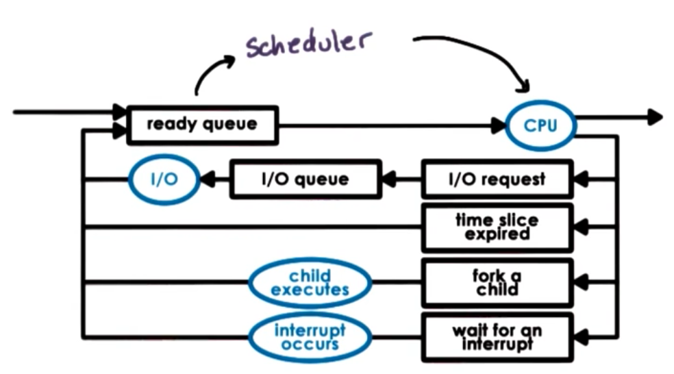

Once a thread is selected by the task scheduler, the thread is dispatched on the CPU: context switch, enter user mode, set program counter and go!

Objective of the schduler is to choose next task to run from ready queue.

- Which task should be selected? Depends on the scheduling policy/algorithm.
- How is this done? Depdens on the runqueue data structure

The design of the runqueue is tightly coupled with scheduling algorithm.

## Run to Completion Scheduling

As soon as a task is assigned to a CPU, it will run until it finishes.

Initial assumptions:

- group of tasks/jobs we need to schedule
- known execution times
- no preemption: once a task is scheduled, it will run until it finishes
- single CPU

Evaluation metrics:

- throughput
- avg. job completion time
- avg. job wait time
- CPU utilization

First Come First Serve (FCFS)

- schedules tasks in order of arrival
- runqueue will be a FIFO like queue.
- scheduler will only need to know where the head of the queue is, and how to deque a task from the queue

> Example
> T1 = 1s, T2 = 10s, T3 = 1s
>
> Throughput = 3/12s = 0.25tasks/s
> Average Completion time = (1 + 11 + 12)/3 = 8s
> Average Wait Time = (0 + 1 + 11)/3 = 4s

Shortest Job First (SJF)

- schedules tasks in order of their execution time
- for previous example, we will execute T1 (1s) -> T3 (1s) -> T2 (10s)
- runqueue will look like an ordered queue. When tasks are inserted, they will be inserted in a specific order.
- runque can also looklike a tree. The left most node will always have the least execution time.

> Example
> T1 = 1s, T2 = 10s, T3 = 1s
>
> Throughput = 3/12s = 0.25tasks/s
> Average Completion time = (1 + 2 + 12)/3 = 5s
> Average Wait Time = (0 + 1 + 2)/3 = 1s

### Preemptive Scheduling

We relax our previous assumptions. Now tasks can be preempted and do not arrive at the same time.

> Example
>
> | Task | Exec Time | Arrival Time |
> | ---- | --------- | ------------ |
> | T1   | 1 sec     | 2            |
> | T2   | 10 sec    | 0            |
> | T3   | 1 sec     | 2            |

#### SJF + Preemption

- T2 arrives first
- T2 should be preempted
- Whenever tasks enter the runqueue, the scheduler need to involved and reschedule tasks.

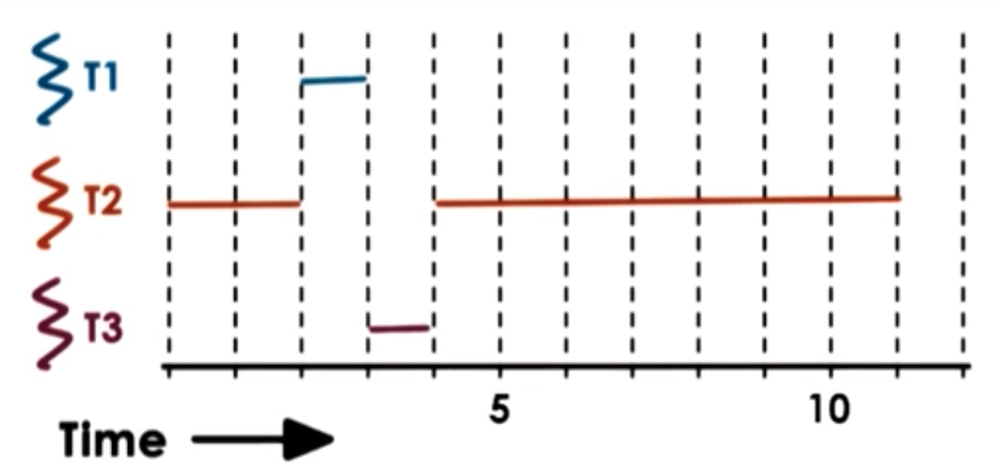

We do not always have the knowledge about the exact execution time. There for, we need to use some heuristics based on history to estimate what the execution time of a task will be. For example, we can use the past execution time.

- how long did a task run last time
- how long did a task run last n times (windows average)

#### Priority Scheduling

- Tasks have differetn priority levels.
- run highest priority task next

> Example
>
> | Task | Exec Time | Arrival Time | Priority |
> | ---- | --------- | ------------ | -------- |
> | T1   | 1 sec     | 2            | Low      |
> | T2   | 10 sec    | 0            | Medium   |
> | T3   | 1 sec     | 2            | High     |

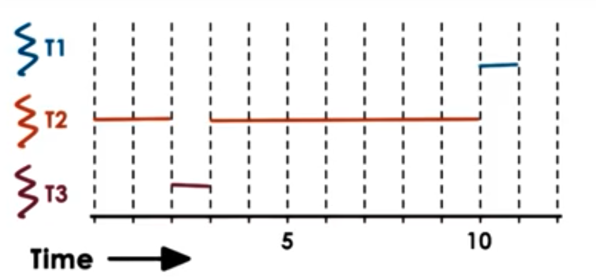

To achieve Priority Scheduling

- use multiple level runqueues: per priority queues
- use tree structures ordered based on priorities

Issues of priority scheduling

- low priorty task stuck in a runqueue due to constant inflow of higher priority tasks (starvation)
- starvation can be solved by priority aging, where priority is a function of actual priority and time spent in runqueue

#### Priority Inversion

Assume SJF here.

> Example
>
> | Task | Arrival Time | Priority |
> | ---- | ------------ | -------- |
> | T1   | 5            | High     |
> | T2   | 3            | Medium   |
> | T3   | 0            | Low      |
>
> - T3 runs for 3s, and creates a lock.
> - T2 runs for 2s, and T1 runs for 2s.
> - T1 needs the lock T3 holds. T1 is preempted, put on a wait queue and T2 runs as long as it needs.
> - T3 execute until it releases the lock.
> - T1 becomes runnable, and preempts T3 to continue execution.

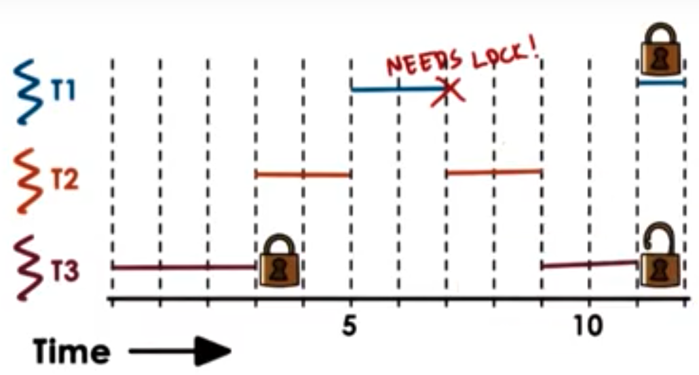

Based on priority, the order of completion should be T1, T2, T3. However, the actual order of execution is actually T2, T3, and T1. We say priorities are "inverted" in this case. One solution to priority inversion is to temporarily boost the priority of mutex owner.

### Round Robin Scheduling

- pick up first tasks from queue (like FCFS)
- task may yield, to wait on I/O (unlike FCFS)

> Example
>
> | Task | Execution Time | Arrival Time |
> | ---- | -------------- | ------------ |
> | T1   | 2              | 0            |
> | T2   | 2              | 0            |
> | T3   | 2              | 0            |

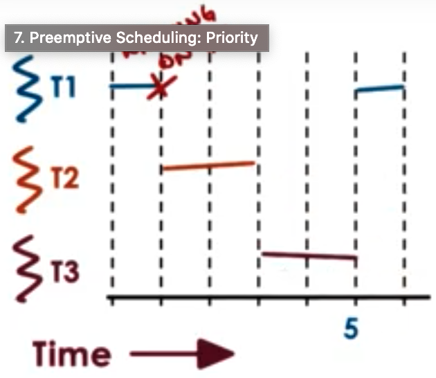

#### Round Robin with Priorities

- include preemption

#### Round Robin with Interleaving

Do not wait for explicit yield. Interrupt tasks at regular time units, and preempt them. We call this technique timeslicing.

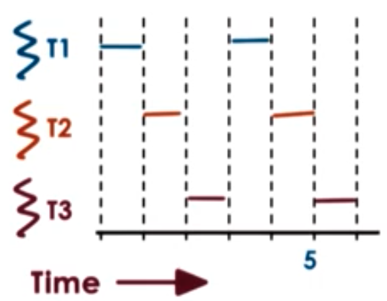

### Timesharing and Timeslices

A timeslice is the maximum amount of uninterrupted time can be given to a task. It is also sometimes referred to as time quantum.

Task may run less than timeslice time. For example, it has to wait on I/O, synchronization, and will be preempted and placed on a queue. In the cases where we have priorities, higher priority tasks become runnable.

Using timeslices allows tasks to be interleaved and timesharing the CPU.

- CPU bound tasks can only be preempted after timeslice

> Example: Round Robin Time Scheduling with timeslice = 1
>
> 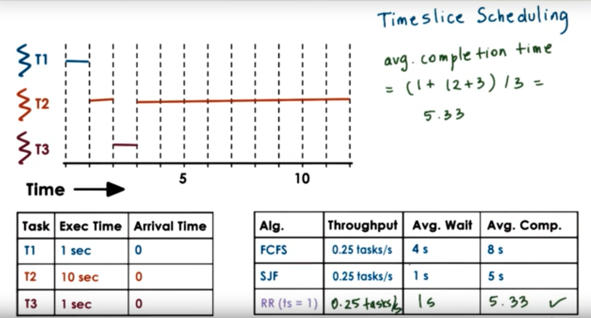

Round robind with timeslices is able to achieve similar performance as SJF without knowing how long the task will take in advance.

Benefits:

- short tasks finish sooner
- more responsive
- length I/O operations can be initiated and executed sooner

Downsides:

- Overheads for performing intterupt, scheduling and context switch (this will cause the actual thoughpput to go down, average wait time and average completion time to go up a little bit)
- To alleviate this overhead cost, we should keep the length of the time slice >> context_switch_time

### How long should a timeslice be?

We need to balance benefits and overheads. The balance differs between:

- I/O bound tasks
- CPU bound tasks

#### CPU Bound Timeslice Length

- 2 tasks, exec time = 10s
- ctx siwtch time = 0.1s

Timeslice = 1 second

- throughput = 2 / (10 + 10 + 19\*0.1) = 0.091 tasks/second
- avg. wait time = (0 + (1+0.1)) / 2 = 0.55 seconds
- avg. comp. time = 21.35 seconds

Timeslice = 5 seconds

- throughput = 2 / (10 + 10 + 3\*0.1) = 0.098 tasks/second
- avg. wait time = (0 + (5+0.1)) / 2 = 3.05 seconds
- avg. comp. time = 17.75 seconds

Timeslice = $\infty$

- throughput = 2 / (10 + 10) = 0.1 tasks/second
- avg. wait time = (0 + (10)) / 2 = 5 seconds
- avg. comp. time = (10 + 20)/2 = 15 seconds

**For CPU bound tasks, larger timeslice is better.**

#### I/O Bound Timeslice Length

- 2 tasks, exec time = 10s
- ctx siwtch time = 0.1s
- I/O operations issued every 1s
- I/O completes in 0.5s

Since I/O operations are issued every 1s, CPU is always released from the thread after 1s. So ts = 1 and ts = 5 perform similarly.

Now consider only T2 is I.O bound. T1 will run 5s, T2 will run 1s and becomes I/O bound, then T1 runs for another 5s, and then T2 runs until it completes.

**For I/O bound tasks, smaller timeslice is better.**

#### Summary

CPU bounds tasks prefer longer timeslices. This enables us to

- limit context switching overheads
- keeps CPU utilization and throughput high

I/O bound tasks prefer shorter timeslices. This allows

- I/O bound tasks can issue I/O operations earlier
- keeps CPU and device utilization high
- better user-perceived performance

### Runqueue Data Structures

Regardless of the data structure, it should be easy for the task scheduler to find the next task to run. If we want I/O and CPU bound tasks to have different timeslice values, then we can either:

- maintain the same runqueue, but allow the scheduler to check task type
- separate different tasks to two different strucutres

#### Dealing with different timeslice values

Multi-queue data structure:

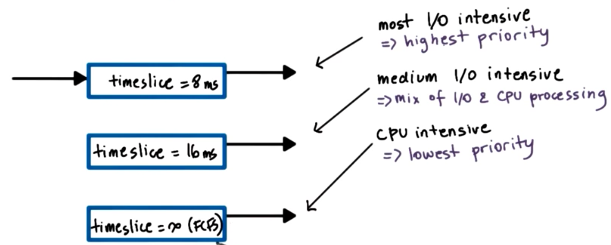

I/O bound tasks will be started as soon as they come in, due to their highest priority. CPU bound tasks are allowed to run until finishes to minimize context switching overheads.

- Timeslicing benefits provided for I/O bound tasks.
- Timeslicing overheads avoided for CPU bound tasks.

How do we know if a task is CPU or I/O intensive?
How do we know how I/O intensive a task is?

- we can use some history based heuristics

What about new tasks?
What about tasks that dynamically change phases in their behavior?

- we treat the three queues as one data structure.

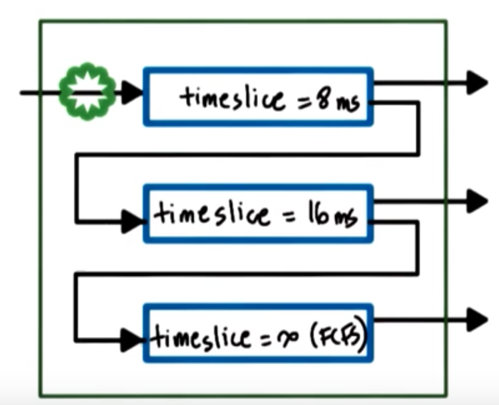

1. Tasks enter topmost queue. We assume it's the most I/O demanding task.
2. If:
   i. task yields voluntarily: it's a good choice and we'll keep task at this level.
   ii. if task uses up entire timeslice: it's more CPU intensive than we thought. Push down to lower level.
3. Keep pushing down the level if the task is more CPU intensive, until it reaches the lowest level.
4. Task in lower queue gets priority boost when releasing CPU due to I/O waits

The resulting structure is called the **multi-level feedback queue (MLFQ)** -- Fernando Corbato

MLFQ is not priority queues.

- It uses different scheduling mechanism of threads at each level
- The structure includes feedback mechanism to adjust which level a task is in

### Linux O(1) Scheduler

O(1) schedule is able to select, add tasks in constant time, regardless of task count. It's a preemptive, priority based scheduler. Priorities are separated into 2 classes:

- Priority 0-99: realtime class
- Priority 100-139: timesharing class

All user processes have one of the timesharing class priority. They default to 120, and can be adjust with by nice value (-20 to 19).

O(1) borrows from MLFQ in the data structure.

- It uses different timeslice values for different priorities: smallest for low priority, and highest for high priority.
- Feedback is based on:
  - sleep time: waiting/idling time. Longer sleep time will interactively boost the priority by -5. Smaller sleep time means it's more computational intensive (always using the CPU), the the priority will be lowered by +5 until it reaches lowest priority (139).

Runqueue of O(1) uses 2 arrays of task queues. Each array element points to the first runnable task at the corresponding priority level.

Active queue is:

- used to pick next task to run
- constant time to add/select: find the first priority level that has time on it
- tasks remain in queue in active array until timeslice expires

Expired queue:

- is an inactive list
- when no more tasks in active array: active array and expired arrays are swapped

O(1) is introduced in Linux 2.5 by Ingo Molnar. But, workloads changed (more video streaming, etc). It is replaced by CFS in 2.6.23 also by Ingo Molnar.

Problems with O(1):

- performance of interactive tasks: once a task is placed on the expired list, it cannot be rescheduled until all tasks on the active queue has executed for their timeslice time.
- fairness: no fairness guarantees (in a time interval, tasks should be able to run for a time proportional to their priorities)

### Completely Fair Scheduler

Runqueue uses a **red-black tree** structure. It is the default scheduler for all non-real time tasks. It belongs to a dynamic tree structure. When elements are added to the tree, it will automatically rebalance itself.

The runqueue is:

- ordered by "virtual runtime (vruntime"
- virtual run time is the time spent on the CPU
- Tasks on the left has spend less time on the CPU, therefore should be scheduled more often

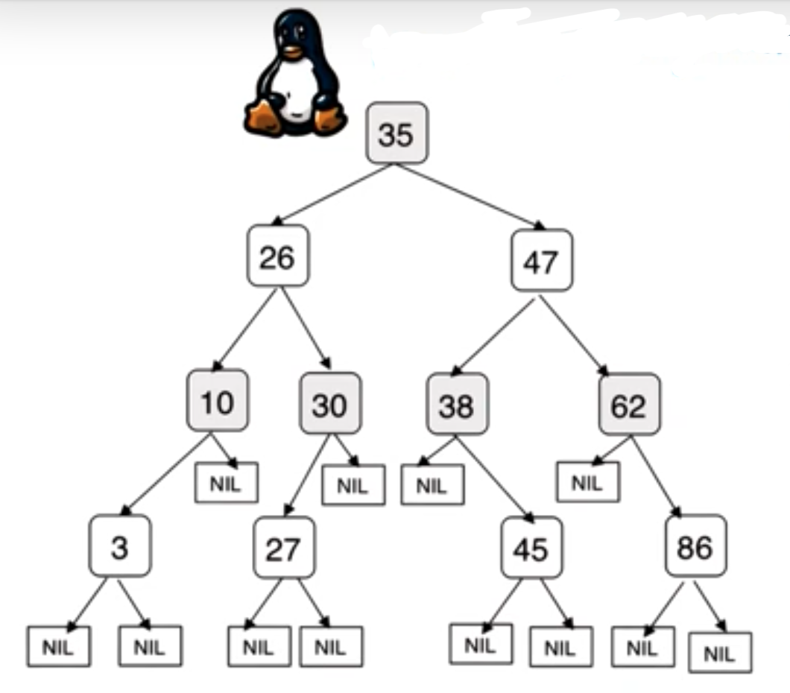

CFS scheduling:

- always pick leftmost node
- periodically adjust vruntime
  - Compare current running task to leftmost vruntime:
    - if smaller, continue running
    - if larger, preempt and place appropriately in the tree
- vruntime progress rate depends on priority and _niceness_
  - rate faster for low-priority
  - rate slower for high-priority (time pass more slowly)
  - same tree for all priorities

Performance:

- Select task: O(1)
- Add task: O(log N), okay for current workload, may need to replace in the future

### Scheduling on Multiprocessors

#### Shared memory multiprocessor (SMP):

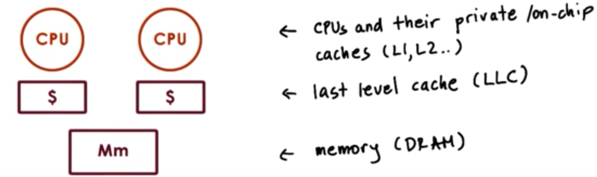

- **Cache-affinity is important**: If a task is scheduled on one CPU, it will slowly bring all the states it need from memory to its cache, hence making its cache hotter. If at this time, we reschedule it to another CPU, then this new CPU will need to again bring all the information it need to the cache.

  - Try to schedule the task on the CPU it was scheduled before
  - Keep tasks on the same CPU as much as possible
  - hierachical scheduler architecture: Per-CPU runqueue and scheduler
    - load balance across CPUs based on queue length or when CPU is idle

Non-Uniform Memory Access (NUMA)

- multiple memory nodes:
- memory node closer to a "socket" of multiple processors:
  - access to local memory node will be faster than access to remote memory nodes
  - keep tasks on CPU closer to memory node where their states are
  - This type of scheduling is called NUMA-aware scheduling

#### Multicore

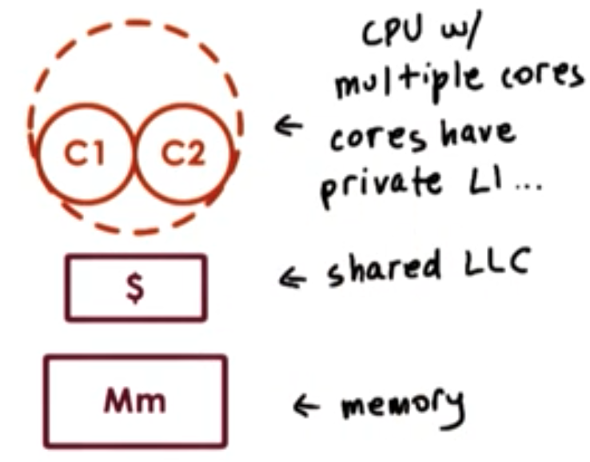

#### Hyperthreading

The reason why we have to context switch among threads is because the CPU has only one set of register to describe the current active execution context.

Multiple sets of registers, each can describe the context of a separate thread: hide latency due to context switching.

- multiple hardware-supported execution contexts
- still 1 CPU but with _very fast_ context switch: just switch register, nothing has to be asved or restored

Referred to as:

- hardware multithreading
- hyperthreading
- chip multithreading (CMT)
- sumultaneous multithreading (SMT)

Assume we have 2 registers in one CPU. Which 2 threads should the scheduler schedule on the 2 registers?

**if (t_idle > 2 \* t_ctx_switch) {context switch to hide latency}**

- SMT ctx_switch - O(cycles)
- memory load - O(100 cycles)

Therefore, hyperthreading can hide memory access latency.

What kinds of threads should we co-schedule on hardware threads?

### Threads and SMT

Assumptions

1. thread can issue instruction on each cycle. max instruction per cycle = 1
2. memory access = 4 cycles. Memory bound process will experience idle cycles
3. Hardware switching is instantaneous (context switching)
4. SMT with 2 hardware threads

#### Co-schedule compute bound threads

- threads "interefere", content for CPU pipeline resource
- for each thread, performance degrades by factor of 2
- memory controller is idle

#### Co-schedule memory-bound threads

- Idle CPU cycles

#### Co-schedule compute-and-memory-bound threads

- mix of CPU and memory intensive threads
- avoid/limit contention on processor pipeline
- all components (CPU and memory) are well utilized (still leads to interference and degradation but minimal)

### How odo we know if a process is CPU-bound or Memory-bound

Use historic information.

Sleep time won't work:

- the thread is not sleeping when waiting on memory
- software takes too much time to compute the sleep time

We need hardware-level information/support to answer this question.

Modern hardware has hardware counters that get updated a the tprocessor is executing and keep information about various aspects of the execution. This include:

- L1, L2, Last Level Cache misses
- IPC
- power and energy data

Sotware interface and tools can be used to access hardware counters:

- oprofile, Linux perf tool
- oprofile website lists available hardware counters on different architectures

Many practical as well as research based scheduling techniques rely on the use of hardware counters to understand something about the requirements of the threads in terms of the kinds of resources that they need. The scheduler can use that information to pick a good mix of the threads that are available in the runqueue to schedule on the system so that of all of the components of the system are well utilized.

- look at a counter like the last level cache misses and using this counter and decide a thread is memory bound (footprint doesn't fit in the cache)
- counter can also tell scheduler that something changed in the execution of the thread so that now it's executing with some different data in a different phase of its execution and running with a cold-cache

One counter can tell us different information about the thread. So from hardware counters, we estimate what kind of resources a thread needs.

Scheduler can make informed decisions regarding the workload mix it needs to select:

- typically uses multiple counters' information to build a more accurate picture of resource needs
- models with per architecture thresholds
- based on well-understood workloads

### Is Cycles-per-Instruction Useful?

Memory-bound threads have high CPI, and CPU-bound tasks have 1 or low CPI

#### Fedora

Testbed

- 4 cores and 4-way SMT
- total of 16 hardware contexts

Workload

- CPI of 1, 6, 11, 16
- 4 threads of each kind

Metric == IPC

- max IPC = 4

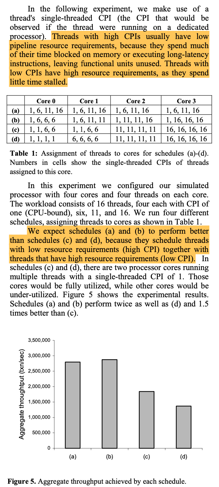

With mixed CPI: processor pipeline well utilized, and high IPC
With same CPI: contention on some cores, and wasted cycles on other cores

Although in theory CPI looks ideal, in reality real workloads do not present too much distinction in CPI values.

Takeaways:

- Resource contention in SMTs for processor pipeline
- hardware counters can be used to characterize workload
- shcedulers should be aware of resource contention, not just load balancing

P.S. LLC usage would have been a better choice.

## Memory Management

### Visual Metaphor

**Operating systems** and **toy shops** each have memory/part managemetn systems.

#### Toy shop

- Uses intelligently sized containers

  - crates of toy parts

- Not all parts are needed at once

  - toy orders completed in stages

- optimized for performance
  - reduce wait time for parts, then we can make more toys

#### Operating System

- Uses intelligently sized containers
  - memory pages or segments
- Not all memory is needed at once
  - tasks operate on subset of memory
- Optimized for performance
  - reduce time to access state in memory, hence better performance

### Memory Management

One of the role of the operating system is to manage physical resoruces. In this case, DRAM, On behalf of one or more executing processes. In order to not to post any limits on the size and layout of an address space based on the amount of physical memory or how it's shared with other processes, we decouple the notion of physical from the virtual memory that's used by the address space.

Pretty much everything uses virtual addresses, and these are translated to the actual, physical address spaces where the particular state is store. The range of the virtual adresses, from V0 to Vmax, establishes the amount of virtual memory that's visible in the system. This can be much larger than the physical memory.

In order to manage the physical memory, the operating system must then be able to allocate physical memory and arbitrate how it's being accessed.

Allocation requires that the OS incorporates certain mechanisms or an algorithms as well as data structures so it can tracks how the physical memory is being used. OS must have mechanisms to decide how to swap data on memory and data in temporary storage.

Arbitration requires the OS is quickly able to intepretate and and verify a process memory access.

#### Page-based memory managment (dominant method)

Virtual memory is divided into fixed sized segments that are called pages. The physical memory, is divided into page frames of the same size. Allocation is mapping pages from the virtual memory to page frame of the physical memories. Arbitration of the access is done via page tables.

#### Segment-based memory management

Allocation doesn't use fix-sized pages. It uses more flexibly sized segments that can be mapped to some regions in physical memory as well as swapped in and out of physical memory. Arbitration of accesses in order to either translate or or validate the appropriate access uses segment registers.

####sHardware support

Hardware has evolved to integrate mechanism to make it easier, fater, and more reliable to perform allocation and arbitration tasks.

- CPU package is equipped with a memory management unit (MMU):

  - translate virtual to physical addresses
  - report faults: illegal access, inadequate permission, not present in memory

- Using designated registers during address translation process

  - page based: pointer to page table
  - segment based: base and limit size, number of segments

- Cache - Translation Lookaside Buffer (TLB)

  - cache of valid virtual to physical address translations
  - translation is faster if translation is present in the cache

- Translation
  - OS maintains page tables, but hardware performs actual translation from physical to virtual address
  - hardware will dictate what type of memory management modes are supported

### Page Tables

Page table is the component that's used to translate the virtual memory addresses into physical memory addresses.

For each virtual address, an entry in the page table is used to determine the actual physical location that corresponds to that virtual address.

By keeping the size of virtual memory and physical memory pages same, we don't have to keep track of the translation of every single individual virtual address. We can only translate the first virtual address in the page. The remaining will map to the offsets in the physical memory page frame. In this way, we can reduce the number of entries we have to maintain in the page table. Only the first portion of the virtual address is used to indextinto the page table. We can this part of the virtual addresss the **virtual page number**, and the rest of the virtual address the **offset**.

The virtual page number is used as an offset into the page table, and that will produce the **physical frame number**, and that is the physical address of the physical frame in DRAM. To complete the translation, the physical frame number needs to be sent with the offset that's specified in the later part of the physical address.

Imagine a case we've allocated virtual address for an array, but has never accessed it before. The first time we access the virtual memory, the OS will realize there isn't physical memory that correspond to the range of virtual memory addresses. It will take a page of physical memory thats free, and establish a mapping between this vritual address. This method of allocating on first access is referred to as **allocation on first touch**. This makes sure physical memory is allocated only when it's really needed.

If a process hasn't used its memory pages for a long time, and it's likely that those pages will be reclaimed. In order to detect this, page tables ahve a number of bits that tell the memory management system something about the validity of the access.

- Unused pages == reclaimed
- mapping becomes invalid
- hardware will fault
- reestablish on reaccess, most likely now at a different physical location
- entry in the page table needs to be updated

Page tables are created

- OS maintains per process
- on context switch, OS needs to switch to valid page table
- hardware update register to point to the correct page table (e.g. CR3 on x86)

### Page Table Entry

Page Table Entry has

- Page Frame Number (PFN)
- Flags:

  - Present bit (valid/invalid)
  - Dirty bit (gets set whenever memory is written to)
  - Accessed bit (whether page has been accessed for read or write)
  - Protection bit (R,W,X)

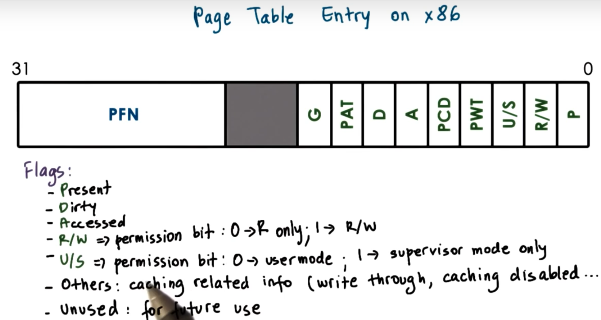

### Page Fault

The MMU uses the page table entries not just to perform the address translation, but also relies on bits to establish the validity of the access. If the hardware determines that a physical memory access cannot be performed, it generates a page fault. CPU will place an error code on kernel stack, and it will generate a trap into the OS kernel.

In turn, a page fault handler is genreated. It will determine action based on error code and faulting address. Key pieces of information in this error code will include

- whether or not the fault the page was not present: bring page from disk to memory
- because permission protection that was violated (SIGSEGV)

On x86

- error code from page table entry flags
- faulting address in CR2

## Page Table Size

A page table has number of entries that is equal to the number virtual page numbers that exist in a virtual address space.

32-bit architecture

- Page Table Entries: 4 bytes, including PFN + flags
- Virtual Page Number (VPN): $2^32$/Page Size
- Page Size: 4KB (can also be 8kb, 2MB, 4MB, ...)

Page table size in this case is $2^32/2^12$ \* 4B = 4MB

64-bit architecture

- Page Table Entries: 8 bytes, including PFN + flags
- Virtual Page Number (VPN): $2^64$/Page Size
- Page Size: 4KB (can also be 8kb, 2MB, 4MB, ...)

Page table size in this case is $2^64/2^12$ \* 8B = 32PB

- Process doesn't use entire address space, or theoretical available virtual memory.
- Even on 32-bit architecture will not always use all of 4GB
- But page table assumes an entry per VPN, regardless of whether corresponding virtual memory is needed or not.

### Hierarchical Page Tables

We don't design page tables using a flat structure any more. Instead, we now design it with a hierarchical structure.

- The outer level (outer page table or top page table) is referred to as a page table directory. Its elements are pointers to page tables.
- Internal page table has proper page tables. They exists only for valid virtual memory regions.
- On malloc a new internal page table may be allocated

To find the right element in the page table structure, the virtual address is split into another component.

- Last portion of the address is the offset
- First 2 components are indices for the outer and inner page table
- Example, 10bits for internal pagetable offset, 10bits for the page => size of internal page table is $2^10 * 2^10 = $1MB
- We can use additional layers (3rd level for page table directory pointer, 4th level for page table directory pointer map)
- important on 64 bit architectures
  - Page table requirements are larger and virtual address spaces of processes tend to be more sparse. There are larger gaps in the virtual address space region.
  - The larger the gaps, the larger the number of internal page table components that won't be necessary as a result of the gap.

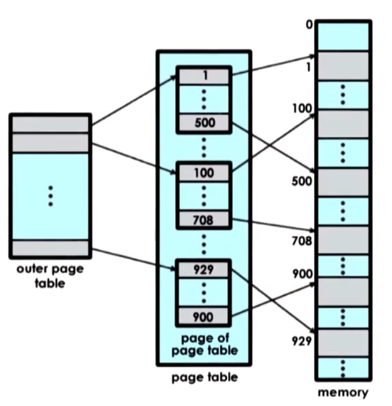

Multi-level page table tradeoffs

**+**:

- As we add multiple levels, the internal page tables and page table directories end up covering smaller regions of the virtual address space. As a result, it is more likely that the virtual ddress space will have gaps that will match that granularity and we will be able to reduce the size of the page table. **potential reduced page table size**

**-**:

- There will be more memory accesses that will be required for translation: we'll have to access each level of the page table components before we produce the physical address. **increased translation latency**

### Speeding up translation TLB

#### Overhead of Address Translation

**Single-level page table**

A memory reference will actually require two memory references:

- one access to page table entry
- one access to memory

#**Four-level page table**

- four accesses to page table entries
- one access to memory

#### Page Table Cache

The standard technique to avoid repeated memory access is to use a page table cache.

**Translation Lookaside Buffer**

- MMU hardware integrates a hardware cache that's dedicated for caching address translations, and this is called the Translation Lookaside Buffer or TLB.
- on TLB miss, then we have to perform page table access from memory
- TLB has all the necessary protection/validity bits to verify the access is correct or to generate a fault
- small number of entries in the TLB can result in a high TLB hit rate and this is because we typically have a high temporal and spatial locality

> x86 core i7
>
> per core:
>
> - 64-entry data TLB
> - 128-entry instruction TLB
> - 512-entry shared second-level TLB

### Inverted Page Tables

Page table entries contain information, one for each element of the physical memory. If we are thinking about physical frame numbers, each of the page table elements will correspond to one physical frame number.

To find the translation, the page table is searched based on the process ID and first part of the virtual address. When the appropriate pid and p entry is found into the page table, the index that will denote the physical frame number of the memory location that's indexed by logical address.

The problem with inverted page table is we have to perform a linear search of the page table to see which one of its entry matches the pid p information that's part of the logical address that was presented by the CPU. In practice, TLB will catch a lot of the references to improve performance.

#### Hashing Page Tables

Inverted page tables are supplemented with hashing page tables. A hash is computed on a part of the address and that is and entry into the hash table taht points to a linkied list of possible matches for this part of the address.

### Segmentation

Virtual to physical memory mapping can be performed using segments. The process is referred to as segmentation.

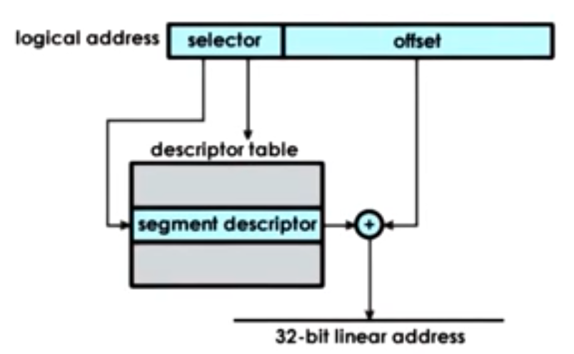

- The address space is divided into components of arbitrary granularity, of arbitrary size, and the different segments will correspond to some logically meaningful components of the address space (like code, heap, data, stack).
- A virtual address includes a segment descriptor, and an offset. The segment descriptor is used in combination with a descriptor table, to produce information regarding the physical address of the segment.

A segment could be represented with a contiguous portion of physical memory. THe segment would be defined by its base address and its limit registers, which implies also the segment size. We can have segments with different size using this method.

In practice, segmentation and paging are used together. The linear address produced by the segmentation process is then passed to the paging unit to compute the actual physical address.

- Intel Architecture x86 32bit: both segmentation and paging are allowed
  - Linux: up to 8k per process/global segmentation
- Intel Architecture x86 64bit: default to just use paging

### How large is a page

10-bit offset: 1kb page size
12-bit offset: 4kb page size

**Linux/x86**:

- 4kB (popular and the default),
- 2MB (large pages, 21 bits offset),
- 1GB (huge pages, 30 bits offset)
- One benefit for large page size is more bits in the address are used for these offset bits, and fewer bits are used to represent the virtual page number, so there will be fewer entries that are needed in the page table. Use of these large page sizes will significantly reduce the size of the page table. (Large reduce page table size by factor of 512, huge by factor of 1024)
- If large memory page is not densely populated, there will be a larger unused gaps with the page itself, and that will lead to internal fragmentation. Because of this issue, smaller page sizes of 4kB are commonly used.
- There are some settings like in memory databases where large and huge page sizes are necessary and make most sense.

Solaris/SPARC: 8kB, 4MB, 2GB

In summary, larger pages will lead to:

**+**: fewer page table entries, smaller page tables, more TLB hits
**-**: internal fragmentation, hence wasted memory

### Memory Allocation

Memory allocation is the job of the memory allocation mechanisms that are part of the memory management subsystem of an operating system.

Memory allocation incorporates mechanisms that decide:

- VA to PA mapping: what are the physical pages that will be allocated to particular virtual memory regions.
  - Once mapping is established, address translations and page tables are used to determine a physical addresss from a virtual address taht the process presents to the CPU, and also perform all checks regarding validity of the access or permissions.

**Kernel level allocators**

- responsible for allocating memory regions, such as pages and various components of the kernel state, for the kernel
- used for certain static process state, e.g. code, stack
- keep track of free memory

**User level allocators**

- dynamic process state (e.g. heap), the state that's dynamically allocated during the process execution.
- Basic interface includes malloc and free. They request from the kernel some amount of memory from its free pages, and release when they are done. Once kernel allocates memory to a malloc call, the kernel is no longer involved in the management of that space.

### Memory Allocation Challenges: external fragmentation

Consider a page based memory manager that needs to manage 16 physical page frames.

- Requests are: alloc(2), alloc(4), alloc(4), alloc(4) frames. There are 2 free page frames left after the request. Memory looks like 1111111111111100.
- Say we free(2), we have 0011111111111100
- Next request is alloc(4). There are 4 free pages but the allocator cannot satisfy the request, as the pages are not contiguous.

This is a problem called external fragmentation. This occurs where we have multiple interleaved allocate and free operations, and as result we have holes of free memory that's not contiguous.

Alternatively, we can allocate not immediately after the first allocation, so the memory will look like

1100111111111111. When we free(2) in this case, first 2 pages are freed and we can satisfy alloc(4).

When pages are freed, there's an opportunity for the allocator to coalese, to aggregate adjacent areas of free pages into one larger free area.

### Allocators in the Linux Kernel

Linux kernel uses 2 allocators. The buddy allocator and the slab allocator.

**Buddy allocator**:

- starts with consecutive memory region that's free that's of a size $2^x$.
- On request, the allocatorwill subdivide this large area in to $2^x$ chunks and find smallest $2^x$ chunk that can satify request.

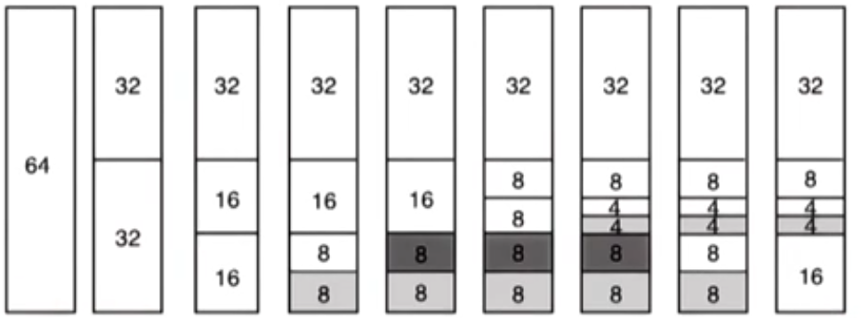

1. alloc(8) request
2. Divided from 6r to 2\*32
3. Divided 32 to 2\*16
4. Divided 16 to 2\*8, and allocate 8 to request
5. Another alloc(8) request, allocate the other 8 to request
6. alloc(4) request, devide the other 16 to 2\*8
7. Devide 8 into 2\*4, and allocate 4 to request
8. Free(8), segmented 8 is produced
9. Free(8), 2\*8 segments are combined into 16

Fragmentation still exists in the buddy allocator, but when a request is freed, it checks its buddy to see if they can be aggregated into a larger chunk.

**+**

- Aggregation of the free areas can be performed well and fast.
- The checking of the free areas can further be propagated up the tree.

**Slab allocator**:

The allocator builds custom object caches on top of slabs. The slabs represent contiguously allocated physical memory. When the kernel starts, it precreates caches for different object types. e.g. task_structure. When an allocation comes from a particular object type, it will go straight to the cache and use one of the elements in this cache. If none of the entries in the cahce is available, the kernel will create another slab and it will preallocate an additional portion of contiguous physical memory to be managed by this slab allocator.

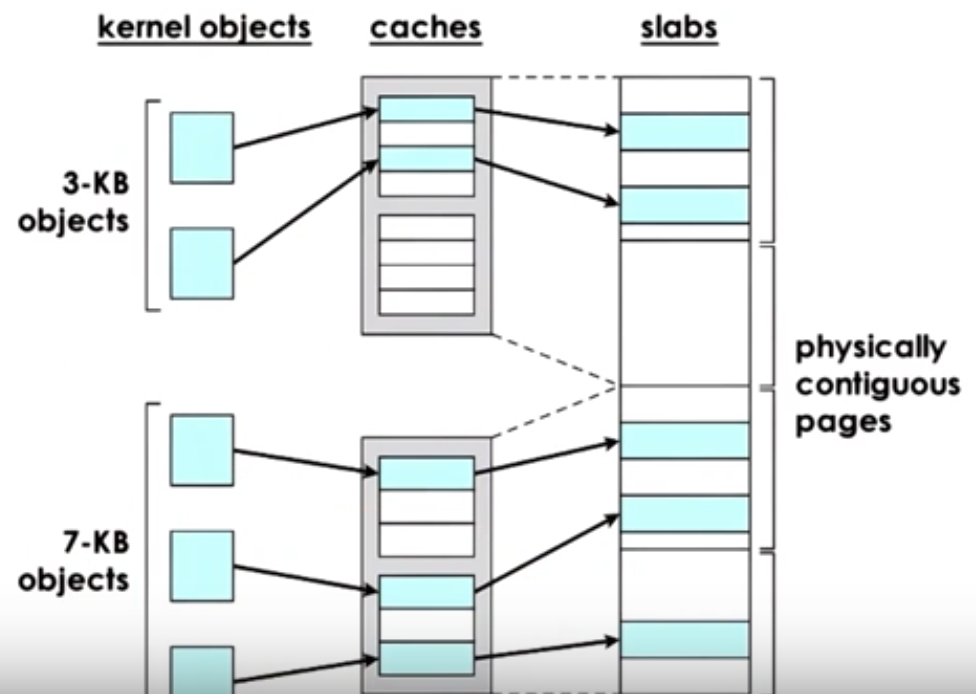

**+**

- internal fragmentation is avoided
- external fragmentation is not an issue: future requests will be of a matching size and then they can be made to fit in these gaps

### Demand Paging

Since physical memory is much smaller than virtual memory:

- allocated pages don't always have to be present in physical memory
- backing physical page frame can be repeatedly saved and restored to/from secondary storage (e.g. disks)

This process is referred to as demand paging, and traditionally with demand paging, pages are moved between main memory and a swap partition (e.g. on disk).

1. When page is not present in memory, its present bit in the page table is set to 0
2. When there is a reference to that page, the MMU will raise an exception that will cause a trap into the OS kernel
3. OS kernel can determine that exception is a page fault, and determine that it ahd previously swapped out this memory page onto disk. It then establish what is the correct disk acceess that needs to be performed. It will issue an I/O operation to retrieve this page.
4. Once page is brought into memory, OS will determine a free frame where this page can be placed.
5. It can use the page frame number for that page to appropriately update the page table entry that corresponds to the virtual address of that page.
6. Control is pushed back into the process that caused this reference, and the program counter will be restarted with the same instruction.
7. This time, page table will find a valid entry with a reference to the udpated physical location.

If we require a page to be constantly present in memory, or require it to maintain the same physical address during its lifetime, then we'll have to **pin** the page, and disable swapping.

### Page Replacement

When should pages be swapped out?

- Periodically when the amount of occupied memory reaches a threshold, the OS will run some page(out) daemon that will look for pages that can be freed
- Swap when memory usage is above threshold
- Swap when CPU usage is below threshold (not to disrupt execution)

Which pages should be swapped out?

- pages that won't be used in the future
- history-based prediction (e.g. Least-Recently Used): it uses the access bit to keep track of whether the page is referenced
- pages that don't need to be written out to disk: dirty bit to track if page is modified
- avoid non-swappable page

In Linux:

- parameters to tune thresholds: target page count
- categorize pages into different types: claimable, swappable
- "second chance" variation of LRU: 2 sets of scans before making the decision

### Copy on Write

MMU hardware can be used for some other services and optimizations beyond address translation.

On process creation

- copy entire parent process address space
- many pages are static and don't change (so why create multiple copies)

On create

- map new VA to original page
- write protect original page
- if prcess only need to read from memory: save memory and time to perform the copy
- If a write request is issued:
  - page fault and copy
  - pay copy cost only if necessary

### Checkpointing

Checkpointing is used as part of the failure and recovery management. The idea is to periodically save the entire process sate. The failure may be unavoidable, however with checkpointing, the process doesn't have to be restarted from the beginning. And recovery will be much faster.

- Simple approach: Pause the execution and copy its entire state.
- Better approach: take advantage of the hardware support for memory management and optimize the disruption checkpointing will cause on execution.
  - We can write protect the entire address space of the process and copy everything at once.
  - copy diffs of "dirtied" pages for incremental checkpoints: recovery can be complex since we have to rebuild using multiple diffs; or in the background we can aggregate diffs to build more complete checkpoints of the process

### From checkpointing to other services

#### Debugging

- Rewind-Replay
- Rewind: restart from checkpoint, and move forward to see if we can reestablish the error
- We can gradually go back to older checkpoints until error can be found

#### Migration

- checkpoint the process to another machine and restart on another machine
- useful for
  - disaster recovery
  - consolidation in data centers when we try to migrate processes and load onto as machines as possible to save on power and energy, or to utilize resources better.
- repeated checkpoints in a fast loop until pause-and-copy becomes acceptable

## Inter-Process Communications

### Visual Metaphor

IPC is like working together in the toy shop.

- Workers share work area
  - communicate by leaving parts and tools on the table to be shared among them
- Workers call each other
  - explicitly request and respond
- Requires sychronization
  - e.g. I'll start when you finish

IPC

- Processes share memory
  - processes can have a portion of physically shared memory, any data they both need access will be placed into this memory
- Processes can exchange messages
  - message passing via sockets
- Requires synchronization
  - mutexes, waiting...

### Inter-Process Communication (IPC)

IPC refers to a set of mechanisms that OS supports in order to permit multiple processes to interact amongst each other. To synchronize, coordiante and communicate all aspects of interaction.

- message passing IPC:
  - sockets, pipes, message queues
- memory based IPC:
  - sahred memory, memory mapped files
- higher-level semantics: mechanisms that support more than simply a channel for coordinate and communicate, that supports additional protocals
  - files, RPC (remote procedure calls)
- synchronization primitives

### Message passing IPC

Processes create messages and then send or receive them.

- OS creates and maintains a channel: buffer/FIFO queue or other data structure for messaging.
- OS provides interface to processes so they can pass messages via the channel - a port
  - processes send/write messages to a port
  - processes receive/read messages from port

OS kernal is required to

- establish the communication channel
- perform every single IPC operation
- send: system call + data copy
- recv: system call + data copy

Request response interaction requires 4 user/kernel crossing and 4 data copies.

Sumamry

**+**: simplicity: kernel does channel management and synchronization
**-**: overheads

### Forms of Message Passing

#### Pipes (also part of the POSIX standard)

Pipes are characterized by 2 end points, so only two processes can communicate. There is no notion of a message. Instead, there's just a stream of bytes that pushed into the pipe from one process and then received into another.

Use case example: connect output from one process to input of another

#### Message Queues

Message queues understand the notion of messages that they transfer. Sending process must submit a properly formatted message to the channel, and channel will deliver a properly formatted message to the receiving process.

OS level functionaly regarding message queues also include:

- priorities of messages
- scheduling the way messages are being delivered

APIs on UNIX: SysV and POSIX

#### Sockets

The notion of ports that's required in message passing IPC mechanisms is the socket abstraction that's supported by the OS.

- `send()`, `recv()` via API to send message buffers in and out of the in kernel communication buffer
- `socket()` create kernel-level socket buffer
- It will associate and necessary kernel-level processing that needs to be performed along with the message movement (e.g. TCP/IP)

If the two processes are one different machines, channel between process and network device.
If same machine, bypass full protocal stack.

### Shared Memory IPC

Processes read and write to shared memory region.

- OS establishes shared channel between the processes
  - physical pages mapped into virtual address space
  - VA(P1) and VA(P2) map to the same physical address
  - the virtual address region that correspond to that shared memory buffer don't need to have the same virtual addresses
  - the pyhsical memory thats backing the shared memory buffer doesn't need to be contiguous

**+**

- system calls only for setup
- data copies potentially reduced (not eliminated)

**-**

- shared memory can be concurrently accessed by both processes. Processes must explicityl synchronize shared memory operations
- programmer's responsibility to determine communication protocol related issues

APIs:
SysV API, POSIX API, memory mapped files, Android ashmem

### Message vs Shared Memory IPC

Goal: transfer data from one into target address space

In message passing, this requires that the CPU is involved in copying the data. CPU cylces are used.

In share memory case: CPU cylces are need to map memory into address space, and copy the data into channel when necessary

- set up once use many times, and therefore good payoff
- can perform well for 1 time use, in particular when we need to move large amount of data from one address space to another, t(copy) >> t(map). In Windows, it exercise this t(copy) vs t(map) comparison in its "Local" Procedure Calls (LPC)

### SysV Shared Memory Overview

- OS supports "segments" of shared memory, that don't necessarily have to correspond to contiguous physical pages
- OS treats shared memory as a system-wide resource, using system-wide policies. This means there is a limit on the total number of segments, and total size of the shared memory.

1. Create: when a process requests that a shared memory segment is created, the OS allocates the required amount of physical memory. Then is assigns to it a **unique key**. The key is used to identify the segment within the OS. Any other process can refer to this segment using this key.
2. Attach: Using the key, the shared memory segment can be attached by a process. This means the OS establishes valid mappings between virtual addresses and physical memory that backs the segment. Multiple processes can attach to the same shared memory segment. In this manner, each process ends up sharing access to the same physical pages.
3. Detach: Detaching as segment means invalidating the address mappings for the virtual address region that correspond to that segment within the process. Page table entries are no longer valid.
4. Destroy: Segments are persistent until there is an explicit request for it to be destroyed. (very different from non-shared memory)

### SysV Shared Memory API

1. `shmget(shmid, size, flag)`: create or open a segment of the appropriate size. Flag includes options like permissions. pid is the key. It is explicitly passed to the OS by the application.  
   `ftok(pathname, prg_id)`: generates a token based on its arguments. Same args will always return the same keys.
2. `shmat(shmid, addr, flags)` attach the shared memory segment into the virtual address space of the process.
   - addr is an option to pass in the virtual address to pass to. If NULL then OS will choose arbitrary suitable address that's available.
   - returned virtual memory can be interpreted in arbitrary ways. It's programmer's responsibility to cast address to the appropriate type.
3. `shmdt(shmid)`: detaches the segment by identifier
4. `shmctl(shmid, cmd, buf)`: destroy with IPC_RHID

### POSIX Shared Memory API

POSIX doesn't use segements. Instead, it uses files. They are not real files.

1. `shm_open()`:
   - returns file descriptor
   - files are in `tempfs` file system
   - key $\approx$ file descriptor
2. `mmap()` and `unmmap()`: mapping virtual to physical addresses
3. `shm_close()`: remove the file descriptor from the address space of the process
4. `shm_unlink()`

[POSIX Shared Memory API](http://man7.org/linux/man-pages/man7/shm_overview.7.html)

### Shared Memory and Synchronization

When data is placed in shared memory, processes have concurrent access to the data. The access must be synchronized to avoid race conditions. This is analogous to threads accessing shared state in a single address space, but for processes.

**Synchronization method**

1. mechanisms supported by process threading library (pthreads)
2. OS-supported IPC for synchronization

**Either method must coordinate**

- number of concurrent accesses to shared segment
- when data is available and ready for consumption

### Pthreads sync for IPC

PTHREAD_PROCESS_SHARED:

- `pthread_mutexattr_t`
- `pthread_condattr_t`

Synchronization data structures must be shared!

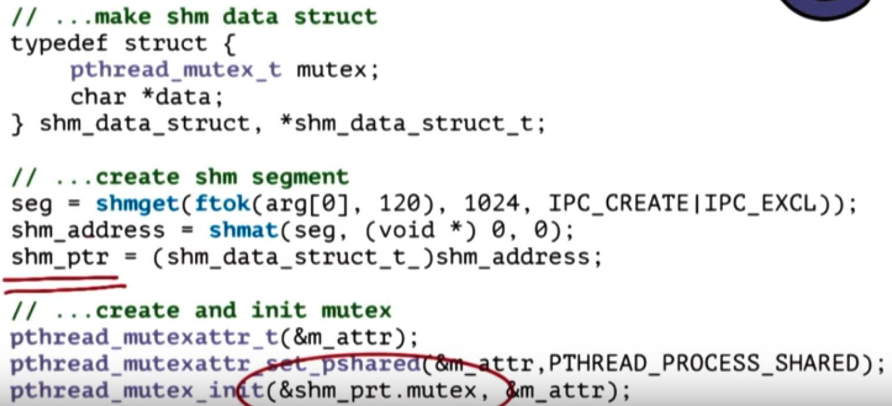

### Other IPC Sync

Message Queues:

- implement "mutual exclusion" via send/recv

> Example Protocol
>
> - P1 writes data to shmem, sends ready to queue
> - P2 receives message, reads data and sends "ok" message back

- send message to message queue `msgsnd`
- receive messages from a message queue `msgrev`
- perform a message control operation `msgctl`
- get a message identifier `msgget`

Semaphores: operating system supported synchronization construct

- binary semaphore can have 2 values: 0 or 1. It can achieve similar type of behavior of mutex.
  - if value == 0: stop/blocked
  - if value == 1: decrement (lock, set value to 0) and go/proceed

[System V IPC](http://www.tldp.org/LDP/lpg/node21.html)
[Message Queue](http://man7.org/linux/man-pages/man3/mq_notify.3.html)
[Semaphore](http://man7.org/linux/man-pages/man3/sem_wait.3.html)

### IPC Command Line Tools

ipcs: list all IPC facilities
`-m` displays info on shared memory IPC only

ipcrm: delete IPC facility
`-m [shmid]` deletes shm segment with given id

### Shared Memory Design Considerations

- Different APIs/mechanisms for synchronization
- OS provides shared memory, and is out of the way
- data passing synchronization protocols are up to the programmer

### How Many Segments

1 large segment: manager for allocating/freeing memory from shared segment
many small segements: use pool of segements, queue of segement ids; communicate segment IDs among processes via other mechanisms like message queue.

### What size segments? What if data doesn't fit?

Segment size == data size => works for well-known static sizes. limits max data size.
Segment size < message size => transfer data in rounds; include protocol to track data movement progress
