# CS 6200 Introduction to Operating Systems

## What is an Operating System

### Shop Manager Metaphor

A shop manager:

- Directs operational resources: use of employee time, parts, tools
- Enforces working policies: fairness, safety, cleanup
- Mitigates difficulty of complex tasks: simplifies operation, optimizes performance

An operating system:

- Directs operational resources: use of CPU, memory, peripheral devices
- Enforces working policies: fair resource access, limits to resource usage
- Mitigates difficulty of complex tasks: abstract hardware details (system calls)

### Attempt do define an operating system

Hardwares (CPU, Memory, GPU, Storage, Network Card) are used by multiple applications. The operating system sits in between the underlying hardwares and the applications. It:

- hides hardware complexity
- manages resource (schedule tasks on CPU, manages memory usage)
- provide isolation and protection (so application do not interfere with each other)

### Operating System Definition

An **operating system** is a layer of systems software that:

- directly has privileged access to the underlying hardware
- hides the hardware complexity (abstraction)
- manages hardware on behalf of one or more applications according to some predefined policies (arbitration)
- ensures that applications are isolated and protected from one another

### Operating Systems Examples

Desktop:

- Microsoft Windows
- Unix-based
  - Mac OSX (BSD)
  - Linux (Ubuntu, Centos, Fedora)

Embedded:

- Android (Linux)
- iOS
- Symbian

Mainframe

### Operating System Elements

- Abstractions:
  - application: process, thread
  - hardware: file, socket, memory page
- Mechanisms:
  - application: create, schedule
  - hardware: open, write, allocate
- Policies (how mechanisms will be used):
  - least-recently used (LRU)
  - earliest deadline first (EDF)

#### Memory management example

- Abstractions: memory page
- Mechanism: allocate, map to a process
- Policies: least recently used (least recently used memory page will be moved to disk, a.k.a swap)

### Design Principles

1. Separation of mechanism and policy

   Implement flexible mechanisms to support many policies, e.g. LRU, LFU, random

2. Optimize for common case

   - Where will the OS be used?
   - What will user want to execute on that machine?
   - What are the workload requirements?

### User/Kernel Protection Boundary

- Kernel level: OS Kernel, privileged mode, direct hardware access
- User level: unprivileged mode, applications

user-kernel switch is supported by hardware:

- trap instructions
- system call: open (file), send (socket), mmap (memory)
- signals

### System Call Flowchart

Flow of synchronous mode: wait until the sys call completes

1. _(user process)_ User process executing
2. _(user process)_ Call system call
3. _(kernel)_ Trap
4. _(kernel)_ Execute system call
5. _(kernel)_ Return
6. _(user process)_ Return from system call

To make a system call an application must:

- write arguments
- save relevant data at well-defined location
- make system call

### Crossing the User/Kernel Protection Boundary

User/Kernel Transitions

- hardware supported: e.g. traps on illegal instructions or memory accesses requiring special privilege
- involves a number of instructions: e.g. 50-100ns on a 2Ghz machine running linux
- switches locality: affects hardware cache!

#### Note on cache

Because context switches will swap the data/addresses currently in cache, the performance of applications can benefit or suffer based on how a context switch changes what is in cache at the time they are accessing it.

A cache would be considered hot if an application is accessing the cache when it contains the data/addresses it needs.

Likewise, a cache would be considered cold if an application is accessing the cache when it does not contain the data/addresses it needs -- forcing it to retrieve data/addresses from main memory.

### Basic OS Services

- Scheduler: access to CPU
- Memory manager
- Block device driver: e.g. disk
- File system

Windows vs Unix

- Process Control:
  - Windows: CreateProcess, ExitProcess, WaitForSingleObject
  - Unix: fork, exit, wait
- File Manipulation
  - Windows: CreateFile, ReadFile, WriteFile, CloseHandle
  - Unix: open, read, write, close
- Device Manipulation
  - Windows: SetConsoleMode, ReadConsole, WriteConsole
  - Unix: ioctl, read, write
- Information Maintenance
  - Windows: GetCurrentProcessID, SetTime, Sleep
  - Unix: getpid, alarm, sleep
- Communication
  - Windows: CreatePipe, CreateFileMapping, MapViewofFile
  - Unix: pipe, shmget, mmap
- Protection
  - Windows: SetFileSecurity, InitializeSecurityDescriptor, SetSecurityDescriptorGroup
  - Unix: chmod, umask, chown

[Linux System Calls Table](https://thevivekpandey.github.io/posts/2017-09-25-linux-system-calls.html)

### Monolithic OS

Historically, OS had a monolithic design. Every possible service any application can require or hardware will make are already included.

- **+** everything included
- **+** inlining, compile-time optimization
- **-** customization, portability, manageability
- **-** memory footprint
- **-** performance

### Modular OS

e.g. Linux

OS specifies interface for any module to be included in the OS. Modules can be installed dynamically.

- **+** maintainability
- **+** smaller footprint
- **+** less resource needs
- **-** indirection can impact performance
- **-** maintenance can still be an issue

### Microkernel

Only require the most basic primitives at OS level. File system, disk driver, etc will run at unprivileged application level.

- **+** size
- **+** verifiability
- **-** portability
- **-** complexity of software development
- **-** cost of user/kernel crossing (more frequent)

## Processes and Process Management

Simple Process Definition:

- Instance of an executing program
- Synonymous with "task" or "job"

### Toy Shop Metaphor

An order of toys:

- state of execution: completed toys, waiting to be built
- parts and temporary holding area: plastic pieces, containers
- may require special hardware: sewing machine, glue gun

A process:

- state of execution: program counter, stack
- parts and temporary holding area: data, register state occupies state in memory
- may require special hardware: I/O devices

### What is a process

OS manages hardware on behalf of applications. Applications are programs on disk, flash memory, etc. They are static entities. Once an application is loaded, it becomes an active entity and is called a process. Process represents the execution state of an active entity.

### What does a process look like

Process encapsulate all states from an application, e.g. text, data, heap, stack. Every state has to be uniquely identified by its address. Address is defined as a range of address from $V_0$ to $V_\text{max}$.

Types of state:

- text and data: static state when process first loads
- heap: dynamically created during execution
- stack: grows and shrinks (LIFO queue)

What have been said above regarding the encapsulation can be called the **address space**. It is the "in memory" representation of a process. We call $V_0$ to $V_\text{max}$ used by the process virtual addresses, in contrast with physical addresses which correspond to locations in physical memory (e.g. DRAM). A Page table created by the OS maintains a mapping of virtual to physical addresses.

32bits: Virtual address space up to 4GB.

Some times applications can share the same physical addresses, and additional states will be swapped in and out of the disk.

### How does the OS know what a process is doing

OS has to have idea of what a process is doing, so it can stop and restart the process at the same point.

- Program Counter: where in the instruction sequence the current is with
- CPU register: maintains program counter while the process is runner
- Stack pointer: where the top of the stack is. It's important because stack is LIFO.

### What is a Process Control Block (PCB)

A data structure that the operating system maintains for every one of the processes that it manages.

- process state, process number, program counter, registers, memory limits, list of open files, priority, signal mask, CPU scheduling info
- PCB created when process is created
- Certain fields are updated when process state changes
- Other fields change too frequently (e.g. registers)

### What is a context switch

A context switch is the mechanism used by the operating system to switch the CPU from the context of one process to the context of another.

They are expensive:

- direct costs: number of cycles for load and store instructions
- indirect costs: cold cache! cache misses

### Process Lifecycle

States of a process:

- New: when a process is created. OS will perform admission control, and create PCB.
- Ready: process is admitted, and ready to start executing. It isn't actually running on the CPU and has to wait until the scheduler is ready to move it into a running state when it schedules it on the CPU.
- Running: ready state process is dispatched by the scheduler. It can be interuppted so that a context switch can be performed. This will move running process back into the ready state.
- Waiting: when a longer operation is initiated (e.g. reading data from disk, waiting for keyboard input), process enters waiting state. When the operation is complete, it will be moved back to ready state.
- Terminated: when all instructions are complete or errors are encountered, process will exit.

### Process creation

Mechanism for process creation

- fork: copies the parent PCB into new child PCB. Child continues execution at instruction after fork.
- EXEC: replace child image. Load new program and start from first instruction.

Note:
The parent of all processes: `init`

### What is the role of the CPU scheduler

A CPU scheduler determines which one of the currently ready processes will be dispatched to the CPU to start running, and how long it should run for.

OS must be able to do the following tasks efficiently:

- preempt: interrupt and save current context
- schedule: run scheduler to choose next process
- dispatch: dispatch process and switch into its context

### How long should a process run for/ How frequently should we run the scheduler

Longer the process runs means less often we are invoking the task scheduler. Consider the following case:

- running process for amount of time $T_p$
- schedular takes amount of $T_\text{sched}$

$$\text{Useful CPU Work} = \frac{\text{Total Processing Time}}{\text{Total time}} = \frac{T_p}{T_p + T_\text{sched}}$$

### Can Processes Interact

An operating system must provide mechanisms to allow processes to interact with each other. Many applications we see today are structured as multiple processes.

Inter Process Communication (IPC) mechanisms:

- transfer data/info between address spaces
- maintain protection and isolation
- provide flexibility and performance

#### Message-passing IPC

- OS provides communication channel, like shared buffer
- Processes write/read messages to.from channel
- **+** OS manages
- **-** overheads: everything needs to go through the OS

#### Shared memory IPC

- OS establishes a shared channel and maps it into each process address space
- Processes directly read/write from this memory
- **+**: OS is out of the way
- **-**: No shared and well defined API because OS is not involved. Can be more error-prone, and developers may need to re-implement code. Mapping memory between processes can also be expensive.

## Threads and Concurrency

### Toy shop worker metaphor

A worker in a toy shop:

- is an active entity: executing unit of toy order
- works simultaneously with others: many workers completing toy orders
- requires coordination: sharing of tools, parts, workstations

A thread:

- is an active entity: executing unit of a process
- works simultaneously with others: many threads executing
- requires coordination: sharing of I/O devices, CPUs, memory

### Process vs Thread

Threads are part of the same virtual address space. Each thread will have a separate program counter, registers, and stack pointer.

### Why are threads useful

- Each thread can execute the same code but for different portions of the input. Parallelization helps to speed up processes.
- Threads can execute different parts of the program.
- Specialization with multiple cores: hotter cache.
- Efficiency: lower memory requirement and cheaper IPC.

### Are threads useful on a single CPU (or # of threads > # of CPUs)

- If $t_\text{idle} > 2 t_\text{context switch}$, then context switch to hide idling time.
- When switching between threads, it is not necessary to recreate virtual to physical memory maps (the most costly step). Therefore, $t_\text{thread context switch} << t_\text{process context switch}$.
- Multithreading is specially useful to high latency in IO operations.

### Benefits to applications and OS code

Multithreaded OS kernel

- threads working on behalf of apps
- OS-level services like daemons or device drivers

### What do we need to support threads?

- thread data structure: identify threads, keep track of resource usage
- mechanisms to create and manage threads
- mechanisms to safely coordinate among threads running concurrently in the same address space

### Threads and concurrency

Processes: Operating in own address spaces. Opearting system prevents overwriting physical addresses.

Threads: They both use the same virtual and physical addresses. Multiple threads can attempt to access the same data at the same time.

### Concurrency Control and Coordination

Synchronization Mechanisms

- Mutual Exclusion
  - exclusive access to only one thread at a time
  - mutex
- Waiting on other threads
  - specific condition before proceeding
  - condition variable
- Waking up other threads from wait state.

### Threads and Thread Creation

- Thread type: thread data structure (threadId, PC, SP, registers, stack, attributes)
- `Fork(proc, args)`: create a thread, not UNIX fork. `t1 = fork(proc, args)` creates a new thread.
- `Join(thread)`: terminate a thread.

### Thread Creation Example

```c
Thread thread1;
Shared_list list;
thread1 = fork(safe_insert, 4);
safe_insert(6);
join(thread1); // Optional, blocks parent thread
```

Result can be:

- 4 $\rightarrow$ 6 $\rightarrow$ NIL
- 6 $\rightarrow$ 4 $\rightarrow$ NIL

How is the list updated?

```
create new list element e
set e.value = X
read list and list.p_next
set e.point = list.p_next
set list.p_next = e
```

### Mutual Exclusion

Mutex data structure:

- whether it's locked
- owner of mutex
- blocked threads

Birrell's Lock API

```c
lock(m) {
  // critical section
} // unlock;
```

Common Thread API

```c
lock(m);
// critical section
unlock(m);
```

### Making safe_insert safe

```c
list<int> my_list;
Mutex m;
void safe_insert(int i) {
  lock(m) {
    my_list.insert(i);
  } // unlock;
}
```

### Producer/Consumer Example

What if the processing you wish to perform with mutual exclusion needs to occur only under certain conditions?

```c
//main
for i=0..10
   producers[i] = fork(safe_insert, NULL) //create producers
consumer = fork(print_and_clear, my_list) //create consumer

// producers: safe_insert
lock(m) {
  list->insert(my_thread_id)
} // unlock;

// consumer: print_and_clear
lock(m) {
  if my_list.full -> print; clear up to limit of elements of list (WASTEFUL!)
  else -> release lock and try again later
} // unlock;
```

### Condition Variable

```c
// consumer: print and clear
lock(m) {
  while (my_list.not_full()) Wait(m, list_full);
  my_list.print_and_remove_all();
}

// producers: safe_insert
lock(m) {
  my_list.insert(my_thread_id);
  if my_list.full()
    Signal(list_full)
}

```

### Condition Variable API

- Wait(mutex, cond): mutex is automatically released and re-acquired on wait
- Signal(cond): notify only one thread waiting on condition
- Broadcast(cond): notify all waiting threads

### Reader/Writer Problem

Readers: 0 or more can access
Writer: 0 or 1 can access

```python
if read_counter == 0 and write_counter == 0:
  read okay, write okay
if read_counter > 0:
  read okay
if write_counter > 0:
  read no, write no
```

State of shared file/resource:

- free: resource.counter = 0
- reading: resource.counter > 0
- writing: resource.counter = -1

### Reader/Writer Example

```c
Mutex counter_mutex;
Condition read_phase, write_phase;
int resource_counter = 0;
```

READERS

```c
Lock(counter_mutex) {
  while (resource_counter == -1)
    Wait(counter_mutex, read_phase);
  resource_counter++;
} // unlock;

// ... read data ...

Lock(counter_mutex) {
  resource_counter--;
  if (resource_counter == 0)
    Signal(write_phase)
} // unlock;
```

WRITER

```c
Lock(counter_mutex) {
  while (resource_counter != 0)
    Wait(counter_mutex, write_phase);
  resource_counter = -1;
} // unlock;

// ... write data ...

Lock(counter_mutex) {
  resource_counter = 0;
  Broadcast(read_phase);
  Broadcast(write_phase);
}
```

### Critical Sections in Readers/Writer Example

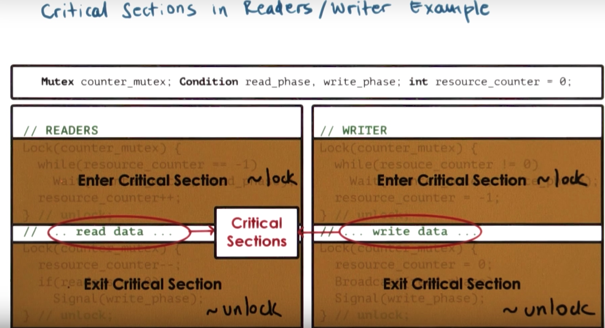

### Critical Section Structure with Proxy Variable

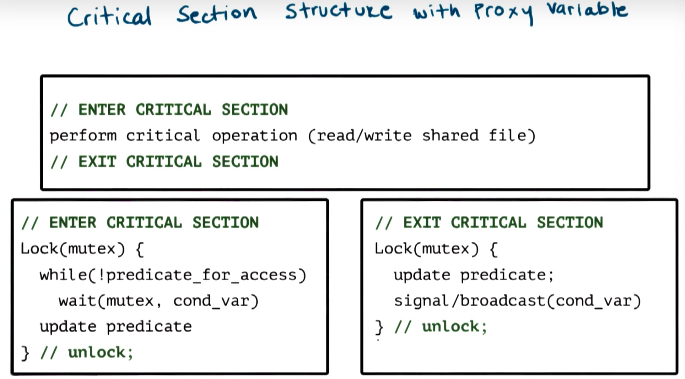

### Avoiding Common Mistakes

- Keep track of mutex/conditional variables used with a resource
  - e.g. mutex_type m1; //mutex for file 1
- Check that you are always (and correctly) using lock and unlock
  - e.g. did you forget to lock/unlock? What about compilers?
- Use a single mutex to access a single resource!
  - e.g. read and write of the same file has 2 mutexs
- Check that you are signaling correct condition
- Check that you are not using signal when broadcast is needed
  - signal: only 1 thread will proceed... remaining threads will continue to wait... possibly indefinitely!
- Ask yourself: do you need priority guarantees?
  - thread execution order not controlled by signals to condition variables!

### Spurious Wake Ups

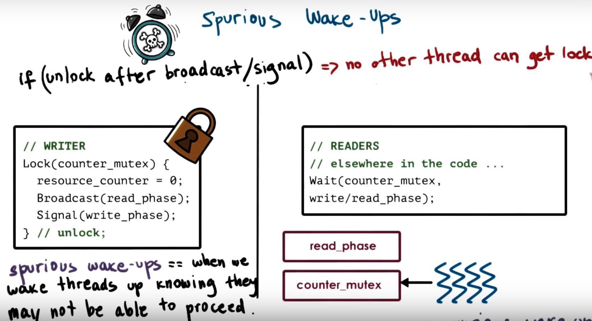
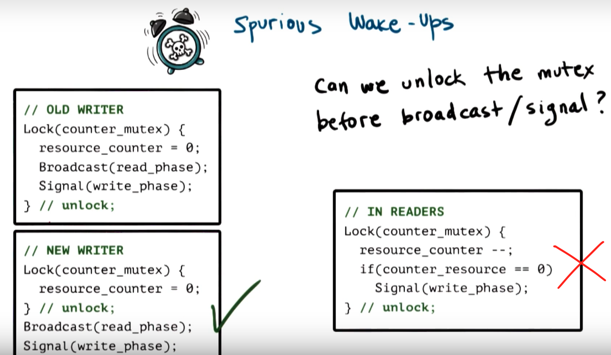

### Deadlocks

Definition:

> Two or more competing threads are waiting on each other to complete, but none of them ever do.

To avoid deadlocks: Maintain lock order across threads, so there is no dead cycles.
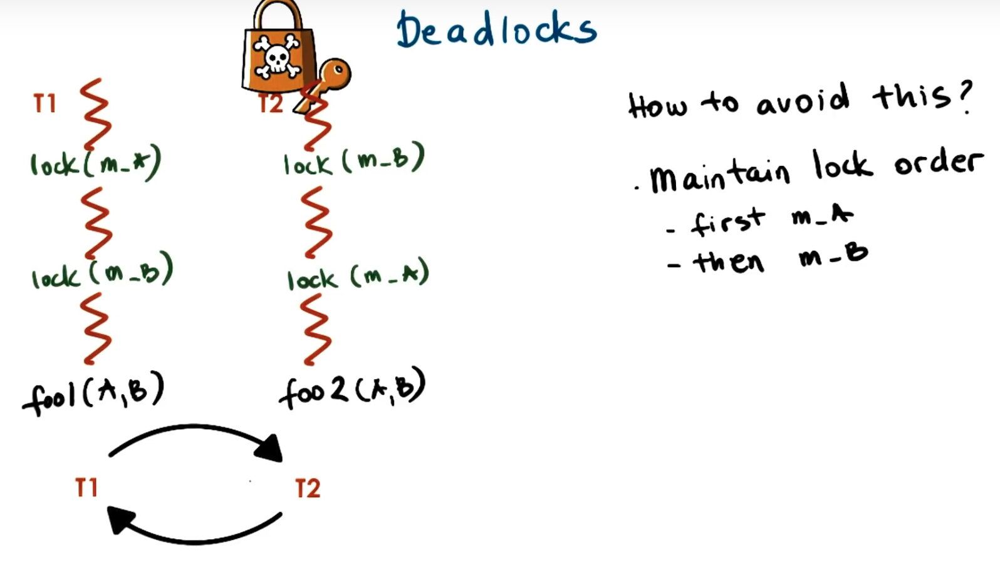

In summary:

> A cycle in the wait graph is necessary and sufficient for a deadlock to occur. (edges from thread waiting on a resource to thread owning a resource)

What can we do about it?

- Deadlock prevention (EXPENSIVE)
- Deadlock detection & recovery (ROLLBACK)
- Apply the ostrich Algorithm (DO NOTHING!) => if all else fails... just REBOOT

### Kernel vs User-Level Threads

#### One to One Model

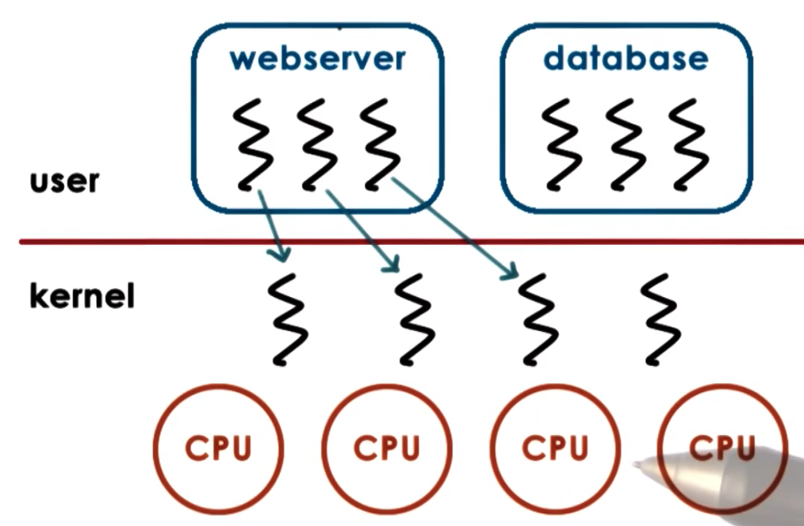

- **+** OS sees/understands threads, synchronization, blocking
- **-**
  - Must go to OS for all operations (may be expensive)
  - OS may have limits on policies, thread #
  - portability

#### Many to One model

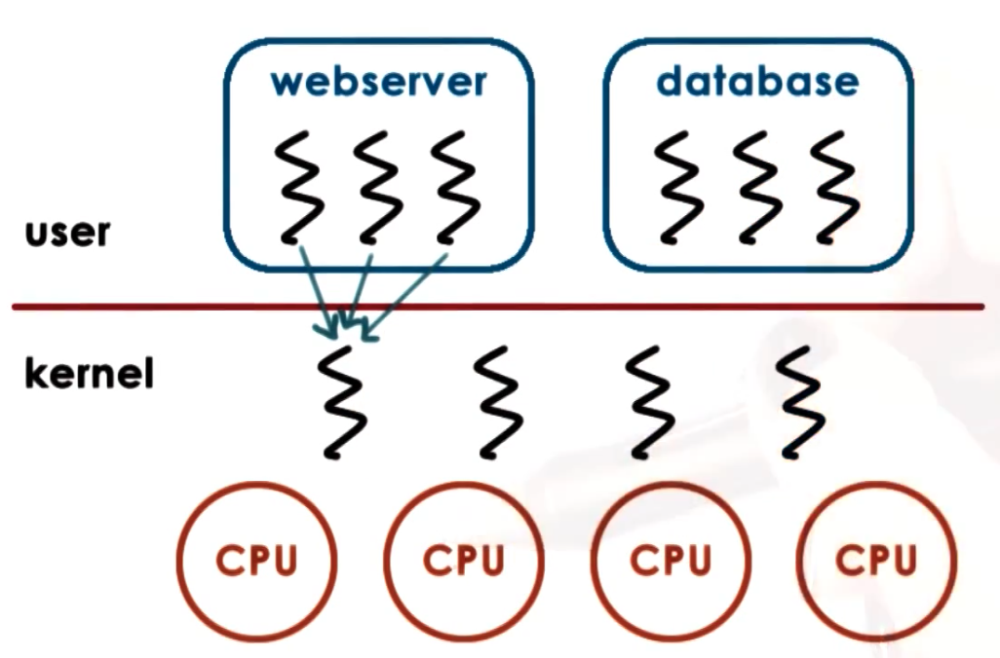

- **+** totally portable, doesn't depend on OS limits and policies
- **-**
  - OS has no insights into application needs
  - OS may block entire process if one user-level thread blocks on I/O

#### Many to Many Model

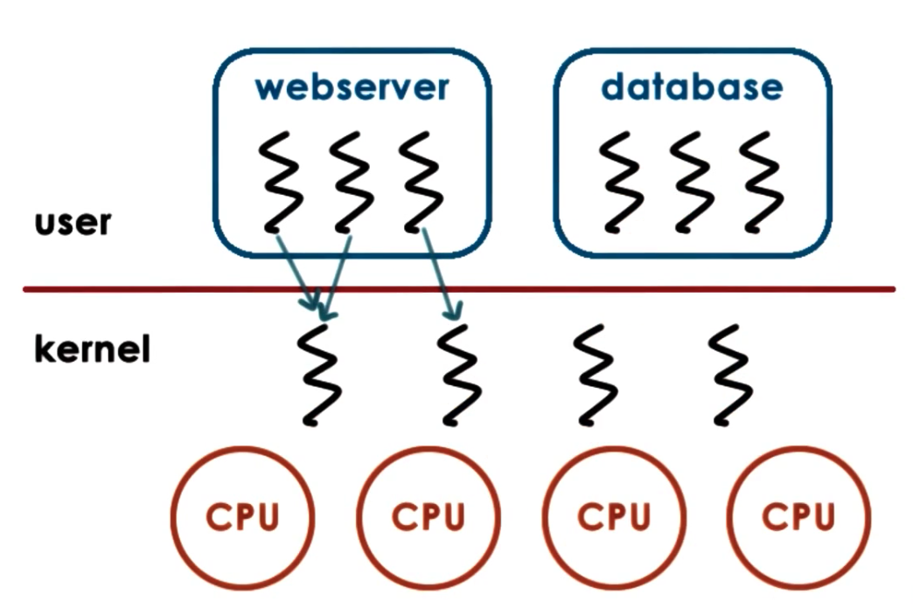

- **+**
  - can be best of both worlds
  - can have bound or unbound threads
- **-**
  - requires coordination between user and kernel level thread managers

#### Scope

- System Scope: System-wide thread management by OS-level thread managers (e.g. CPU scheduler)
- Process Scope: User-level library manages threads within a single process

### Multithreading Patterns

Toy shop example: for each wooden toy order, we:

1. accept the order
2. parse the order
3. cut wooden parts
4. paint and add decorations
5. assemble the wooden toys
6. ship the order

#### Boss/Workers Pattern

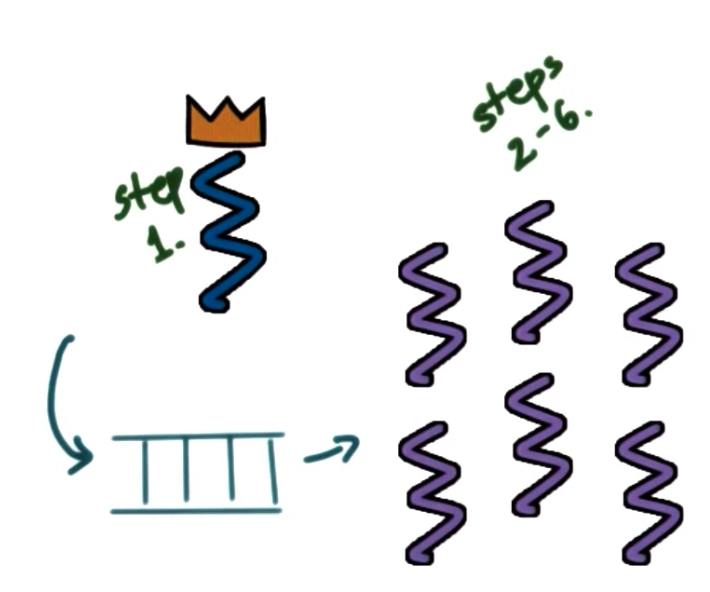

Boss-Workers:

- boss: assigns work to workers (step 1)
- workers: performs entire task (step 2-6)

Throughput of the system limited by boss thread => must keep boss efficient
$$\text{Throughput} = \frac{1}{\text{boss time per order}}$$

**Boss assigns work by**

- directly signalling specific worker
  - **+** workders don't need to synchronize
  - **-** boss must track what each worker is doing, and throughput will go down
- placing work in producer/consumer queue (more often used)
  - **+** boss doesn't need to know details about workers
  - **-** queue synchronization: workers need to synchronize access to the queue, etc

**How many workers**

- on demand
- pool of workers
  - static or dynamic

Boss-Workers:

- boss: assigns work to workers (step 1)
- workers: performs entire task (step 2-6)
- placing work in producer/consumer queue (more often used)
- pool of workers
- **+** simplicity
- **-** thread pool management
- **-** locality

Boss-Workers Variants:

- all workders created equal vs workers specialized for certain tasks
- **+** better locality (hotter cache); quality of service management
- **-** load balancing

#### Pipeline Pattern

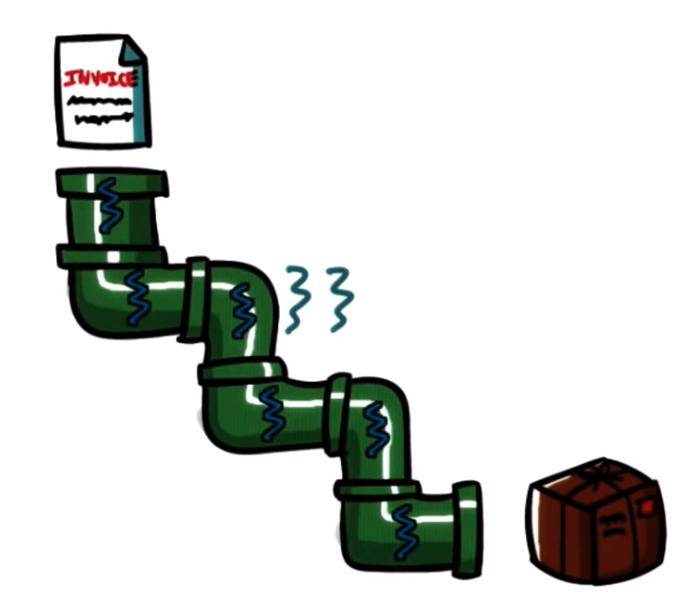

Pipeline:

- threads assigned one subtask in the system
- entire tasks == pipeline of threads
- multiple tasks concurrently in the system, in different pipeline stages
- throughput == weakest link => pipeline stage == thread pool
- shared-buffer based communication between stages

In summary:

- sequence of stages
- stage == subtask
- each stage == thread pool
- buffer-based communication
- **+** specialization and locality
- **-** balancing and synchronization overheads

#### Layered Pattern

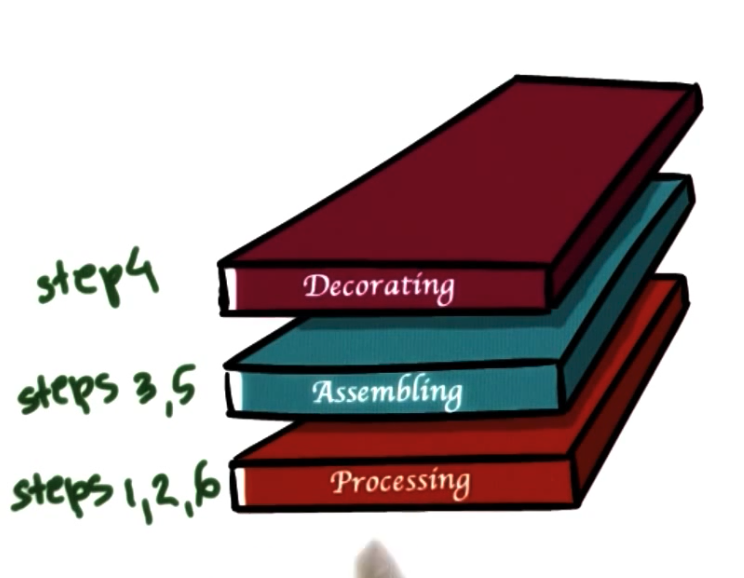

Layered:

- each layer group of related subtasks
- end-to-end task must pass up and down through all layers
- **+** specialization and locality, but less fine-grained than pipeline
- **-** not suitable for all applications
- **-** synchronization

### Time to finish orders

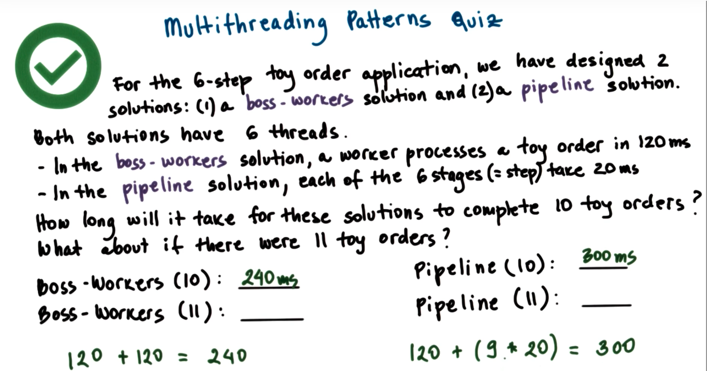

Boss-Worker:

$$ \text{Time to Finish 1 Order} \times \text{Ceiling}(\text{num orders}/\text{num threads}) $$

Pipeline:

$$ \text{time to finish first order} + (\text{remaining orders} \times \text{time to finish last stage})$$

## Threads Case Study: PThreads

PThreads: POSIX Threads
POSIX: Portable Operating System Interface

### Pthread creation

- `Thread`

  ```c
  pthread_t aThread; //type of thread
  ```

- `Fork(proc, args)`

  ```c
  int pthread_create(
    pthread_t *thread,
    const pthread_attr_t *attr,
    void * (*start_routine)(void *),
    void *arg
  );
  ```

- `Join(thread)`

  ```c
  int pthread_join(pthread_t thread, void **status)
  ```

### Pthread Attributes

- `pthread_attr_t`

  - specified in `pthread_create`
  - defines features of the new thread
  - has default behavior with NULL in `pthread_create`

- attributes

  - stack size
  - inheritance
  - joinable
  - scheduling policy
  - priority
  - system/process scope

- methods
  ```c
  int pthread_attr_init(pthread_attr_t *attr);
  int pthread_attr_destroy(pthread_attr_t *attr);
  pthread_attr_{set/get}{attribute}
  ```

### Detaching Pthread

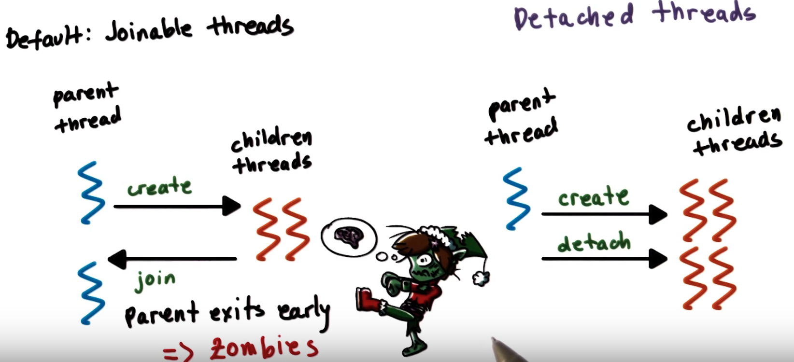

```c
int pthread_detach();
```

Example

```c
#include <stdio.h>
# include <pthread.h>

void *foo (void *arg) { /* thread main */
  printf("Foobar!\n");
  pthread_exit(NULL);
}

int main (void) {

  int i;
  pthread_t tid;

  pthread_attr_t attr;
  pthread_attr_init(&attr); // required!
  pthread_attr_setdetachstate(&attr, PTHREAD_CREATE_DETACHED);
  pthread_attr_setscope(&attr, PTHREAD_SCOPE_SYSTEM); // share resource with all other threads in the system
  pthread_create(&tid, &attr, foo, NULL);

  return 0;

}
```

### Compiling Pthreads

1. `#include <pthread.h>` in main file
2. compile source with `-lpthread` or `-pthread`
   ```sh
   gcc -o main main.c -lpthread
   gcc -o main main.c -pthread
   ```
3. check return values of common functions

### Quiz 1

```c
#include <stdio.h>
#include <pthread.h>

#define NUM_THREADS 4

void *hello (void *arg) { /* thread main */
  printf("Hello Thread\n");
  return 0;
}

int main (void) {
  int i;
  pthread_t tid[NUM_THREADS];

  for (i = 0; i < NUM_THREADS; i++) { /* create/fork threads */
    pthread_create(&tid[i], NULL, hello, NULL);
  }

  for (i = 0; i < NUM_THREADS; i++) { /* wait/join threads */
    pthread_join(tid[i], NULL);
  }
  return 0;
}
```

### Quiz 2

```c
/* A Slightly Less Simple PThreads Example */

#include <stdio.h>
#include <pthread.h>

#define NUM_THREADS 4

void *threadFunc(void *pArg) { /* thread main */
  int *p = (int*)pArg;
  int myNum = *p;
  printf("Thread number %d\n", myNum);
  return 0;
}

int main(void) {
  int i;
  pthread_t tid[NUM_THREADS];

  for(i = 0; i < NUM_THREADS; i++) { /* create/fork threads */
    pthread_create(&tid[i], NULL, threadFunc, &i);
  }

  for(i = 0; i < NUM_THREADS; i++) { /* wait/join threads */
    pthread_join(tid[i], NULL);
  }
  return 0;
}
```

- `i` is defined in main => it's globally visible variable
- when it changes in one thread => all other threads see new value

### Quiz 3

```c
/* PThread Creation Quiz 3 */

#include <stdio.h>
#include <pthread.h>

#define NUM_THREADS 4

void *threadFunc(void *pArg) { /* thread main */
  int myNum = *((int*)pArg);
  printf("Thread number %d\n", myNum);
  return 0;
}

int main(void) {

  int i;
  int tNum[NUM_THREADS];
  pthread_t tid[NUM_THREADS];

  for(i = 0; i < NUM_THREADS; i++) { /* create/fork threads */
    tNum[i] = i;
    pthread_create(&tid[i], NULL, threadFunc, &tNum[i]);
  }

  for(i = 0; i < NUM_THREADS; i++) { /* wait/join threads */
    pthread_join(tid[i], NULL);
  }

  return 0;
}
```

### Pthread Mutexes

"to solve mutual exclusion problems among concurrent threads"

- `mutex`

  ```c
  pthread_mutext_t aMutex; // mutex type
  ```

- `Lock(mutex)`

  ```c
  // explicit lock
  int pthread_mutex_lock(pthread_mutex_t *mutex);
  // run critical section
  // explicit unlock
  int pthread_mutex_unlock(pthread_mutex_t *mutex);
  ```

safe insert example

```c
list<int> my_list;
pthread_mutex_t m;
void safe_insert(int i) {
  pthread_mutex_lock(m);
  my_list.insert(i);
  pthread_mutex_unlock(m);
}
```

### Other Mutex Operations

Attributes

```c
int pthread_mutex_init(pthread_mutex_t *mutex, const pthread_mutexattr_t *attr);
// mutex attributes == specifies mutex behavior when a mutex is shared among processes
```

Try Lock

```c
int pthread_mutex_trylock(pthread_mutex_t *mutex);
```

Destroy

```c
int pthread_mutex_destroy(pthread_mutex_t *mutex);
```

### Mutex Safety Tips

- Shared data should always be accessed through a single mutex
- mutex scope must be visible to all
- globally order locks
  - for all threads, lock mutexes in order
- always unlock a mutex
  - always unlock the correct mutex

### Pthread Condition Variables

- `Condition`

  ```c
  pthread_cond_t aCond; // type of cond variable
  ```

- `Wait`

  ```c
  int pthread_cond_wait(pthread_cond_t *cond, pthread_mutex_t *mutex);
  ```

- `Signal`

  ```c
  int pthread_cond_signal(pthread_cond_t *cond);
  ```

- `Broadcast`

  ```c
  int pthread_cond_broadcast(pthread_cond_t *cond);
  ```

- Others

  - `pthread_cond_init`
  - `pthread_cond_destroy`

### Condition Variable Safety Tips

- Do not forget to notify waiting threads
  - predicate change => signal/broadcast correct condition variable
- When in doubt broadcast
  - but performance loss
- You do not need a mutex to signal/broadcast

### Producer/Consumer Example

```c
#include <stdio.h>
#include <stdlib.h>
#include <pthread.h>

#define BUF_SIZE 3    /* Size of shared buffer */

int buffer[BUF_SIZE];    /* shared buffer */
int add = 0;        /* place to add next element */
int rem = 0;        /* place to remove next element */
int num = 0;        /* number elements in buffer */

pthread_mutex_t m = PTHREAD_MUTEX_INITIALIZER;    /* mutex lock for buffer */
pthread_cond_t c_cons = PTHREAD_COND_INITIALIZER; /* consumer waits on this cond var */
pthread_cond_t c_prod = PTHREAD_COND_INITIALIZER; /* producer waits on this cond var */

void *producer (void *param);
void *consumer (void *param);

int main(int argc, char *argv[]) {

  pthread_t tid1, tid2;  /* thread identifiers */
  int i;

  /* create the threads; may be any number, in general */
  if(pthread_create(&tid1, NULL, producer, NULL) != 0) {
    fprintf(stderr, "Unable to create producer thread\n");
    exit(1);
  }

  if(pthread_create(&tid2, NULL, consumer, NULL) != 0) {
    fprintf(stderr, "Unable to create consumer thread\n");
    exit(1);
  }

  /* wait for created thread to exit */
  pthread_join(tid1, NULL);
  pthread_join(tid2, NULL);
  printf("Parent quiting\n");

  return 0;
}

/* Produce value(s) */
void *producer(void *param) {

  int i;
  for (i=1; i<=20; i++) {

    /* Insert into buffer */
    pthread_mutex_lock (&m);
      if (num > BUF_SIZE) {
        exit(1);  /* overflow */
      }

      while (num == BUF_SIZE) {  /* block if buffer is full */
        pthread_cond_wait (&c_prod, &m);
      }

      /* if executing here, buffer not full so add element */
      buffer[add] = i;
      add = (add+1) % BUF_SIZE;
      num++;
    pthread_mutex_unlock (&m);

    pthread_cond_signal (&c_cons);
    printf ("producer: inserted %d\n", i);
    fflush (stdout);
  }

  printf("producer quiting\n");
  fflush(stdout);
  return 0;
}

/* Consume value(s); Note the consumer never terminates */
void *consumer(void *param) {

  int i;

  while(1) {

    pthread_mutex_lock (&m);
      if (num < 0) {
        exit(1);
      } /* underflow */

      while (num == 0) {  /* block if buffer empty */
        pthread_cond_wait (&c_cons, &m);
      }

      /* if executing here, buffer not empty so remove element */
      i = buffer[rem];
      rem = (rem+1) % BUF_SIZE;
      num--;
    pthread_mutex_unlock (&m);

    pthread_cond_signal (&c_prod);
    printf ("Consume value %d\n", i);  fflush(stdout);

  }
  return 0;
}
```

## Thread Design Considerations

### Kernel vs User-level Threads

- Kernel-level Threading: OS Kernel maintains thread abstraction, scheduling, sync, ...
- User-level Threading:
  - User-level library provides thread abstraction, scheduling, sync
  - different process can use different threading libraries
- Mappings: one to one, one to many, many to one

### Thread-related data structures

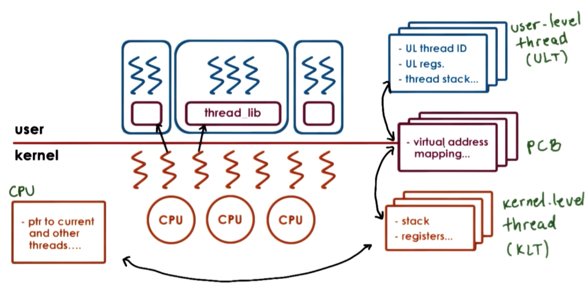

### Hard and Light Process State

When two threads point to the same process, there are information in the process control block that are specific to each thread, and there are also information that's shared between these two threads. We split these information into two states:

- "light" process state: specific to each thread. e.g. signal mask, sys call args
- "hard" process state: shared across threads belong to the same process e.g. virtual address mapping

### Rationale for Multiple Data Structures

Single PCB:

- large continuous data structures
  - **-** scalability
- private for each entity
  - **-** overheads
- saved and restored on each context switch
  - **-** performance
- update for any changes
  - **-** flexibility

Multiple data structures:

- smaller data structures
  - **+** scalability
- easier to share
  - **+** overheads
- on context switch only save and restore what needs to change
  - **+** performance
- update for any changes
- user-level library need only update portion of the state
  - **+** flexibility

### SunOS 5.0 Threading Model

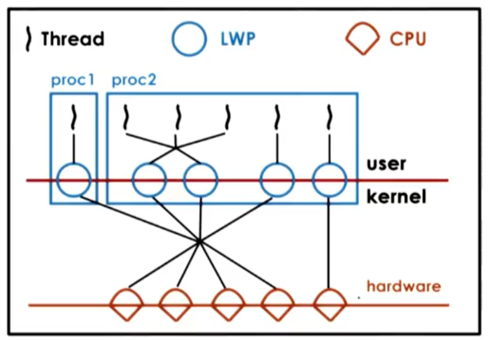

### User-level Thread Data Structures

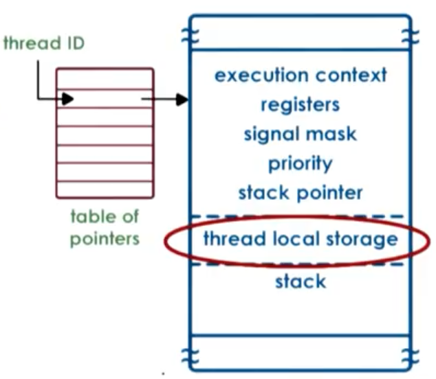

"Implementing Lightweight Threads"

- not POSIX threads, but similar
- thread creation => thread ID (tid)
- tid => index into table of pointers
- table pointers point to per thread data structure
- stack growth can be dangerous! As OS do not have knowledge of multiple threads, as stack of one thread grows, it can overwrite data for another thread. Debug is hard as cause error in one thread is caused by another thread.
  - solution => red zone (portion of virtual address space that's not allocated. When thread grows large, it will write to red zone, which will in turn cause a fault. Now it is easier to reason about the fault because the problem is caused directly by the same source.)

### Kernel-level Data Structures

Process

- list of kernel-level threads
- virtual address space
- user credentials
- signal handlers

Light-Weight Process (LWP): similar to ULT, but visible to kernel. Not needed when process is not running

- user level registers
- system call args
- resource usage info
- signal mask

Kernel-level Threads: information needed even when process not running => not swappable

- kernel-level registers
- stack pointer
- scheduling info (class, ...)
- pointers to associated LWP process, CPU structures

CPU

- current thread
- list of kernel-level thread
- dispatching and interrupt handling information

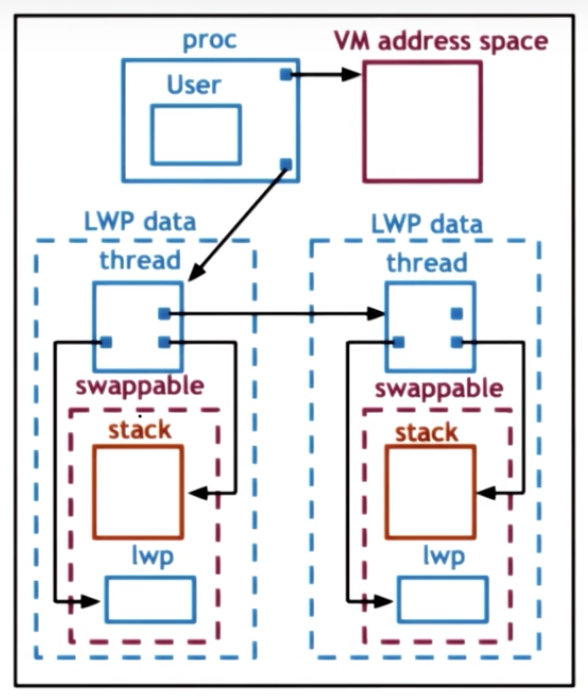

### Basic Thread Management Interactions

- User-level library does not know what is happening in the kernel
- Kernel does not know what is happening in user-level library

=> System calls and special signals allow kernel and ULT library to interact and coordinate

Also see: `pthread_setconcurrency()`

### Lack of Thread Management Visibility

User-Level library Sees:

- ULTs
- available KLTs

Kernel sees:

- KLTs
- CPUs
- KL scheduler

User level thread has a lock => kernel preempted the thread => none of other user level threads can proceed => kernel cycle through threads, and complete the thread with lock

Many to Many:

- UL Scheduling decisions
- change ULT-KLT mapping

Invisible to Kernel:

- mutex variable
- wait queues

Problem: Visibility of state and decisions between kernel and user level library; one to one helps address some of these issues

### How/When does the UL library run>

Process jumps to UL library scheduler when:

- ULTs explicitly yield
- timer set by UL library expires
- ULTs call library functions like lock/unlock
- blocked threads become runnable

ULT library scheduler

- runs on ULT operations
- runs on signals from timer or kernel

### Issues on multiple CPUs

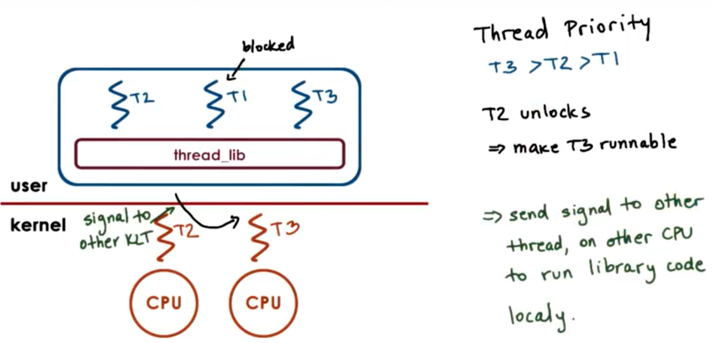

### Synchronization-Related Issues

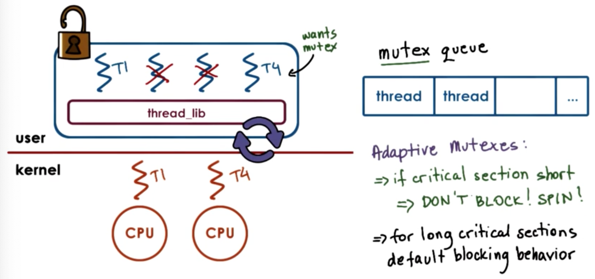

### Destroying Threads

- Instead of destroying... reuse threads
- When a thread exits
  - put on a death row
  - periodically destroyed by reaper thread
  - otherwise thread structures/stacks are reused => performance gains

### Interrupts vs Signals

Interrupts

- events generated externally by components other than the CPU (I/O devices, timers, other CPUs)
- determined based on the physical platform
- appear asynchronously
- external notification to notify CPU some event has occurred

Signals

- events triggered by the CPU and software running on it
- determined based on the operating system
- appear synchronously or asynchronously

Interrupts and signals

- have a unique ID depending on the hardware or OS
- can be masked and disabled/suspended via corresponding mask
  - per-CPU interrupt mask, per-process signal mask
- If enabled, trigger corresponding handler
  - interrupt handler set for entire system by OS
  - signal handlers set on per process basis, by process

### Visual Metaphor

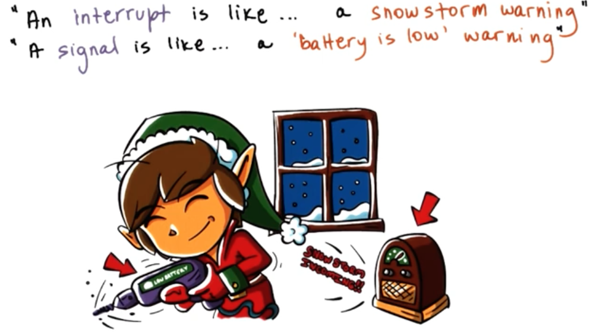

Toyshop example:

- hanlded in specific ways
  - safety protocols, hazard plans
- can be ignored
  - continue working
- expected or unexpected
  - happen regularly or irregularly

Interrupt and signal:

- hanlded in specific ways
  - interrupt and signal handlers
- can be ignored
  - interrupt/signal mask
- expected or unexpected
  - appear synchronously or asynchronously

### Interrupts

MSI: message signal interruptor

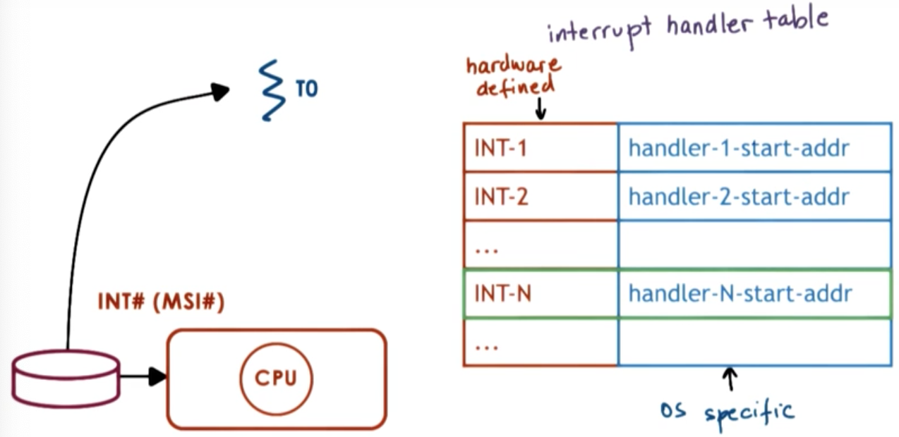

### Signals

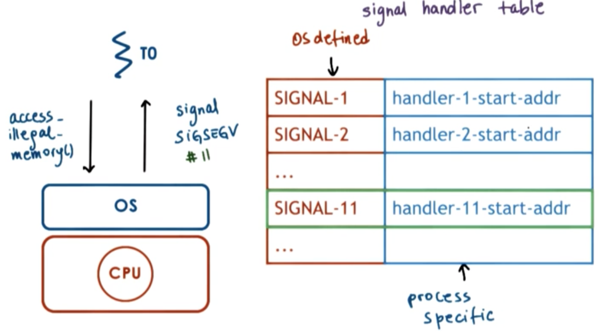

Handlers/Actions

- Default Actions
  - Terminate, Ignore, Terminate and Core Dump, Stop or Continue
- Process Installs Handler
  - signal(), sigaction()
  - for most signals, some cannot be caught

Synchronous Signals

- SIGSEGV (access to protected memory)
- SIGFPE (divide by zero)
- SIGKILL (kill, id) can be directed to a specific thread

Asynchronous Signals

- SIGKILL (kill)
- SIGALARM

### Why disable interrupts or signals?

Sometimes interrupts/signals can create deadlocks.

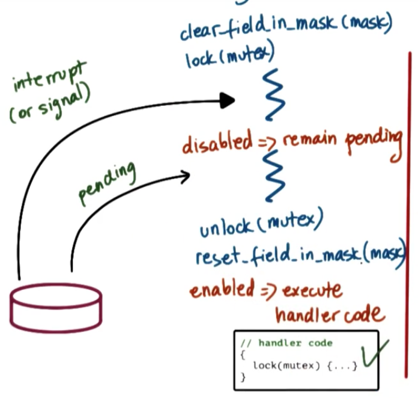

1. keep handler code simple => too restrictive
2. control interruptions by handler code => use interrupt/signal masks
   - mask is a sequences of 0s and 1s, e.g. `0 0 1 1 1 0 0 1 1 0 ...`: 0 - disabled, 1 - enabled

### More on masks

Interrupt masks are per CPU:

- if mask diables interrupt => hardware intterupt routing mechanism will not deliver interrupt to CPU

Signal masks are per execution context (ULT on top of KLT):

- if masks disables signal => kernel sees mask and will not interrupt corresponding thread

### Interrupts on Multicore Systems

- Interrupts can be directed to any CPU that has them enabled
- may set interrupt on just a single core => avoids overheads and perturbations on all other cores

### Types of signals

One-shot signals

- "n signals pending == 1 signal pending": signal will be handled at least once
- must be explicitly re-enabled; e.g. the handler has been invoked by signal. Future instances of the signal will be handled by OS default, or ignored.

Real Time Signals

- "if n signals raised, then handler is called n times"

#### POSIX signals

- `SIGINT` terminal interrupt signal
- `SIGURG` high bandwidth data is available on a socket
- `SIGTTOU` background process attempting write
- `SIGXFSZ` file size limit exceeded

### Handling Interrupts as Threads

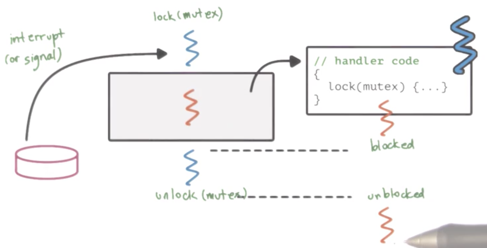

Dynamic Thread Creation is Expensive! Ways to mitigate this cost:

- Use dynamic decision when creating interrupts as threads:

  - if handler doesn't lock => execute on interrupted thread's stack
  - if handler can block => turn into real thread

- Optimization

  - precreate and preinitialize thread structures for interrupt routines

### Top vs Bottom Half of Interrupts

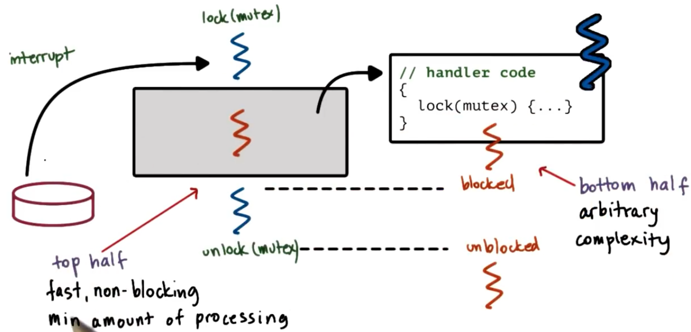

Execute simpler interrupts in the top half, and leave the more complex interrupts in the bottom half, as separate threads.

### Performance of Interrupts as Threads

Overall Costs

- overhead of 40 SPARC instructions per interrupt
- saving of 12 instructions per mutex
  - there is no changes in interrupt mask, level ...
- fewer interrupts than mutex lock/unlock operations => it's a win!

### Threads and Signal Handling

What to do when signal masks between user and kernel level are not in sync?
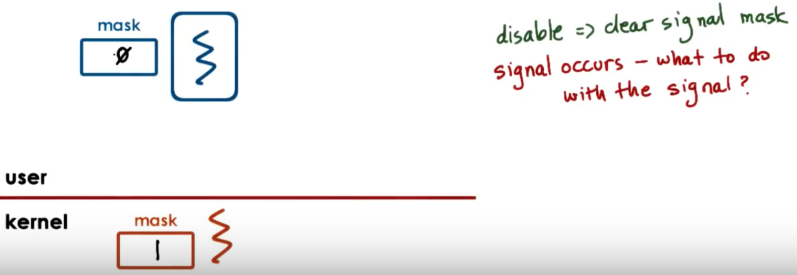

#### Case 1

Process is safe when user level and kernel level masks are then same.
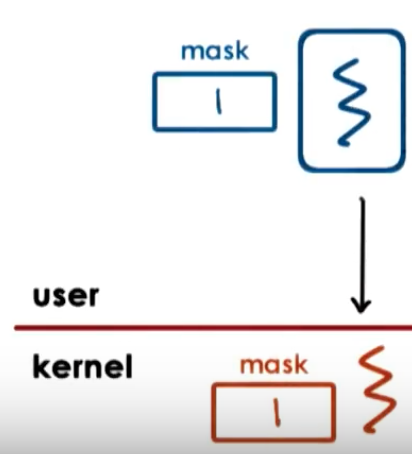

#### Case 2

ULT executing has mask 0, KLT has mask 1. Kernel level signal invokes user library handling routine through signal handling table. User library sees which runnable user level thread can handle the signal, and execute that user level thread on the kernel level thread.

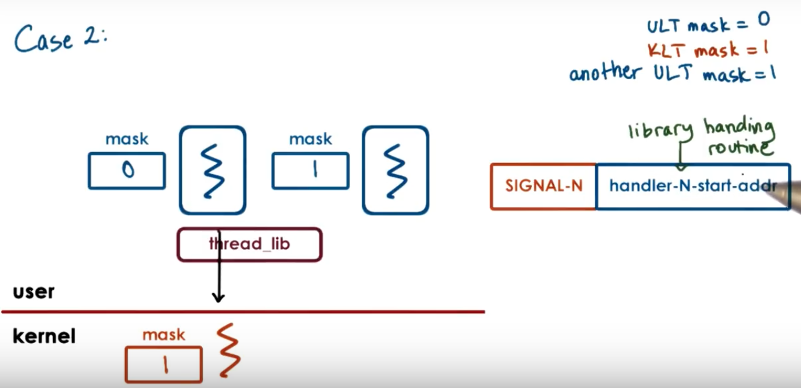

#### Case 3

The ULT that has mask = 1 which can handle the signal is already executing on another kernel level thread. In this case, user library handler send a directed signal to the kernel that thread is executing on, which is then passed back to the ULT to handle.

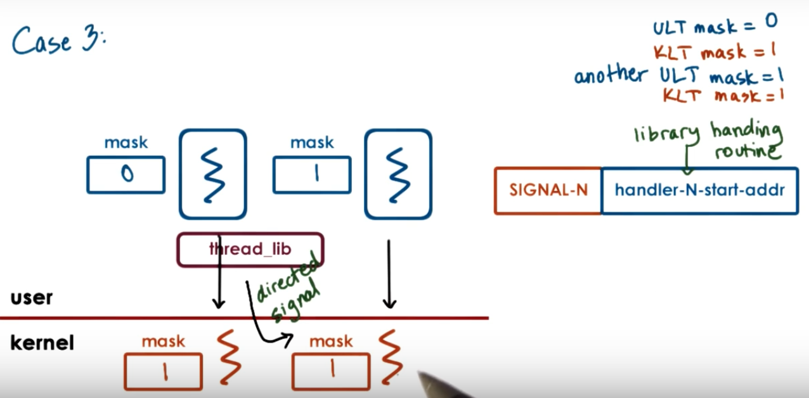

#### Case 4

All ULT masks are 0. Threading library will perform system call to change underlying kernel level thread mask to 0. The threading library will reissue the signal again. If it finds another KLT, the kernel level mask will be changed to 0 as well, until all KLT masks are 0 as well.

Optimize common case:

- signals less frequent than signal mask updates
- system calls avoided: cheaper to update UL mask
- signal handling more expensive

### Task Struct in Linux

- Main execution abstraction: task
  - kernel level thread
- Single-threaded process: one task
- Multi-threaded process: many tasks

```c
struct task_struct { // ~ 1.7kb
  pid_t pid; // task identifier
  pid_t tgid; // task group id: the task id thats first created for a group of tasks, also used to identify the group
  int prio;
  volatile long state;
  struct mm_struct *mm;
  struct files_struct *files;
  struct list_head tasks; // list of tasks that are part of a single process
  int on_cpu;
  cpumask_t cpus_allowed;
}
```

#### Task Creation: Clone

`clone(function, stack_ptr, sharing_flags, args`

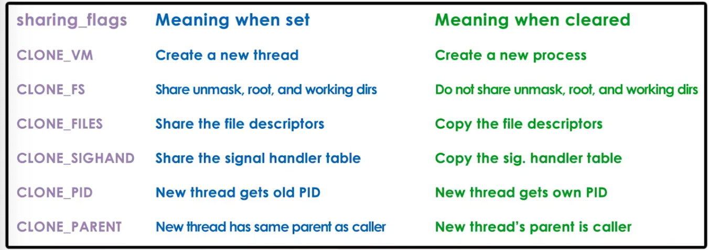

#### Linux Thread Model

Native POSIX Threads Library (NPTL): one to one model

- kernel sees each ULT info
- kernel traps are cheaper
- more resources: memory ,large range of IDs

Older LinuxThreads: mang to many model

- similar issues to those described in Solaris papers

## Thread Performance Considerations

### Which threading model is better?

6 workers in total, to complete 11 toy orders.

By total execution time, pipeline model is better. However, by average time to complete order, the boss-worker model is better.

Which model is better depends on the goal.

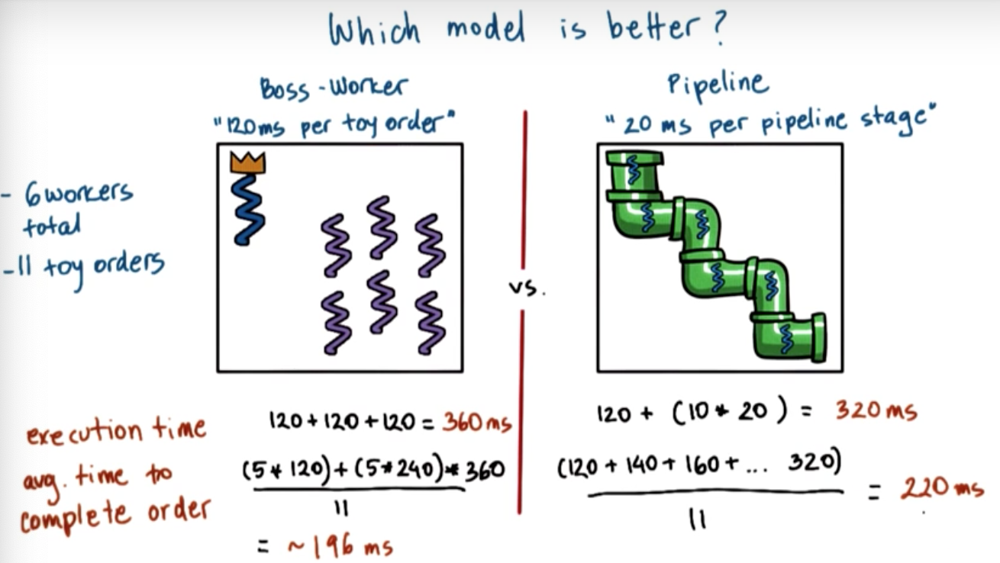

### Are threads useful?

Threads are useful because of:

- parallelization => speed up
- specialization => hot cahce
- efficiency => lower memory requirement and cheaper to sychronization

Threads hide latency of I/O operations (even on a single CPU)

### What is useful?

Different tasks have different metrics for measuring usefulness. It is important to know the property that matters most.

- For a matrix multiply application => execution time
- For a web service application =>
  - number of client requests/time
  - response time
  - measure by average, max, min, 95% performance
- For hardware => hire utilization (e.g. CPU)

### Visual Metaphor

Metrics exist for operating systems and for toy shops.

- Toy Shop

  - Throughput
    - How many toys per hour?
  - Reponse time
    - Average time to react to a new order
  - Utilization
    - Percent of workbenches in use over time
  - Many more ...

- Operating Systems
  - Throughput
    - process completion rate
  - Reponse time
    - Average time to respond to iput (e.g. mouse click)
  - Utilization
    - Percent of CPU
  - Many more...

### Performance Metrics

Metrics == a measurement standard

- measurable and/or quantifiable property
  - e.g. execution time
- of the system we are interested in
  - e.g. software implementation of a problem
- that can be used to evaluate the system behavior
  - e.g. its improvement compared to other implementations

Examples:

- execution time
- throughput
- request rate
- CPU utilization
- wait time
- platform efficiency
- performance per dollar
- percentage of SLA violations (service level agreement)
- client-perceived performance
- aggregate performance

Measurable quantity obtain from

- experiments with real software deployment, real machines, real workloads
- 'toy' experiments representative of realistic settings
- simulation

We refer to the above experiment settings as testbeds.

### Are threads useful?

- Depends on metrics
- Depends on workload

- Different number of toy orders => different implementation of toy shop
- Different type of graph => different shortest path algorithm
- Different file patterns => different file system

=> It depends!

### How to best provide concurrency

Multiple threads vs Multiple processes

e.g. Web server: concurrently process client requests

Steps in a simple web server

1. client/browser send request
2. webserver accepts request
3. server processing steps
   a. accept conn
   b. read request
   c. parse request
   d. find file
   e. compute header
   f. send header
   g. read file, send data
4. respond by sending file

#### Multi-Process Web Server

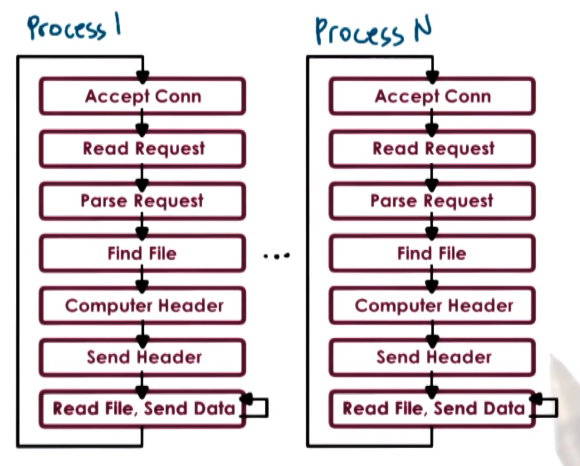

**+** simple programming
**-** many processes => high memory usage, costly context switch

#### Multi-Threaded Web Server

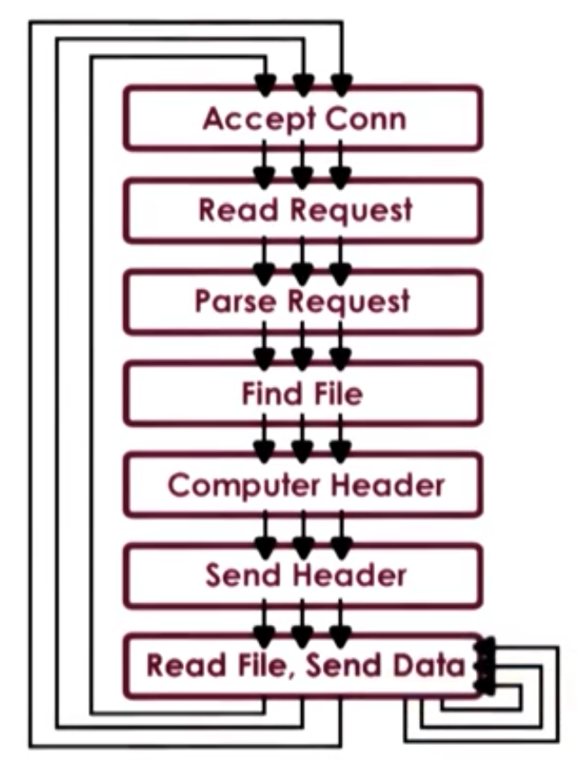

**+** shared address space, shared state, cheap context switch
**-** not simple implementation, requires synchronization, underlying support for threads

### Event-Driven Model

Application is implemented in:

- Single address space
- Single process
- Single thread of control

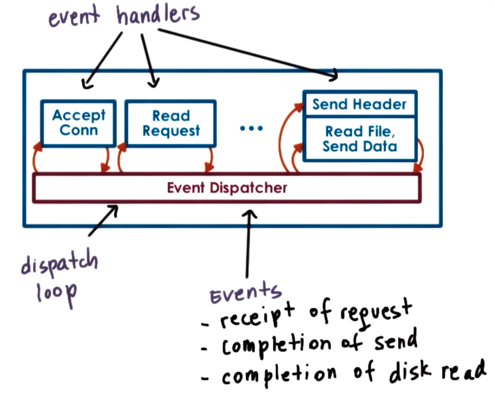

Event dispatcher in continuous dispatch loop looks for incoming events and invokes event handlers.

- dispatcher == state machine
- external events => call handler == jump to code

Handler

- run to completion
- if they need to block: initiate blocking operation and pass control to dispatcher loop

### Concurrent Execution in Event-Driven Loop

- Multi-Process and Multi-Thread: 1 request per execution context (process/thread)
- Event-Driven: Many requests interleaved in an execution context

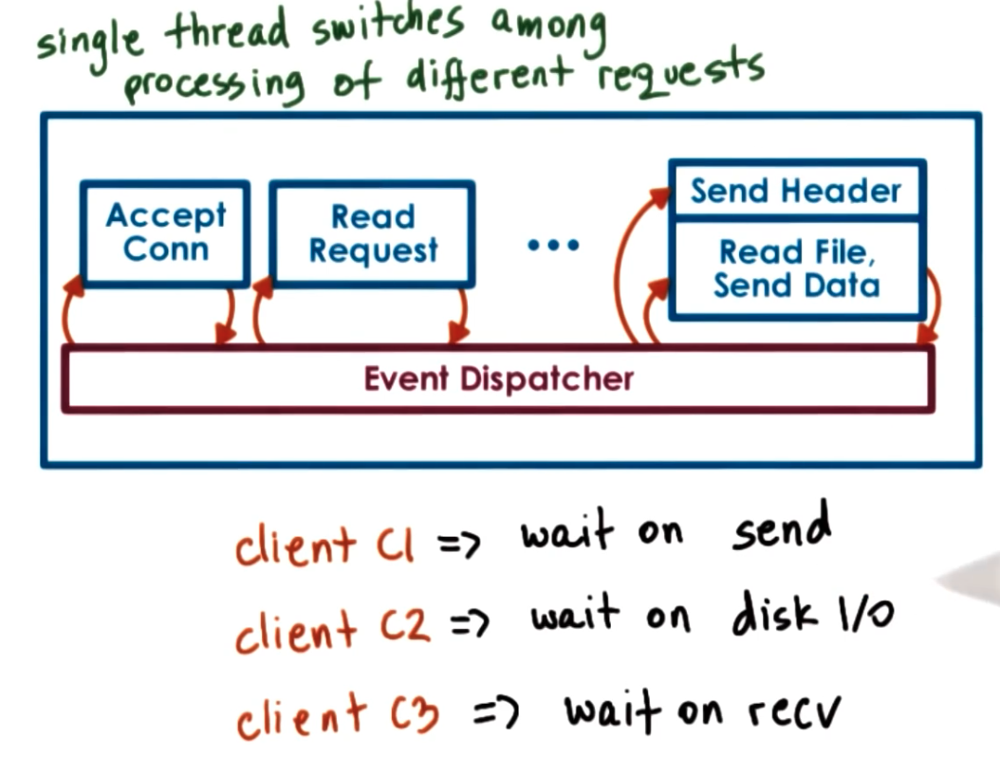

#### Why does this work?

On 1 CPU "threads hide latency"

- `if (t_idle > 2 * t_ctx_switch)` => context switch to hide latency
- `if (t_idle == 0)` context switch just wastes cycles that could have been used for request processing
- Event Driven: Process request until wait necessary then switch to another request

Multiple CPUs => multiple event-driven processes

#### Benefits of Event-Driven Model

- Single address space
- Single flow of control
- Smaller memory requirement
- no context switching
- no synchronization

#### Problem with Event-Driven Model

- a blocking request/handler will block the entire process

Can be solved by aynchronous I/O operations. Aynchronous system call:

- process/thread makes system call
- OS obtains all relevant info from stack, and either learns where to return results, or tells caller where to get results later
- process/thread can continue

This requires support from kernel (e.g. threads) and/or device => Fits nicely with event-driven model.

#### What is Async calls are not available?

Helpers:

- designated for blocking I/O operations only
- pipe/socket based communication with event dispatcher => select()/poll() still ok
- helper blocks, but main event loop (andd process) will not

Helper THreads/Processes:

- **+** resolves portability limitations of basic event-driven model
- **+** smaller footprint than regular worker thread
- **-** applicability to certain classes of applications
- **-** event routing on multi-CPU systems

### Flash Event-Driven Web Server

- an event-driven webserver (AMPED)
- with asymmetric helper processes

- helpers used for disk reads
- pipes used for communication with dispatcher
- helper reads file in memory (via mmap)
- dispatcher chekcs (via mincore) if peges are in memory to decide 'local' handler or helper => possible BIG savings

#### Additional Optimizations

- application-level caching (data and computation)
  - pathname translation cache
  - response header cache
  - mapped file cache
- Alignment for DMA (direct memory access)
- Use of DMA with scatter-gather => vector I/O operations

### Apache Web Server

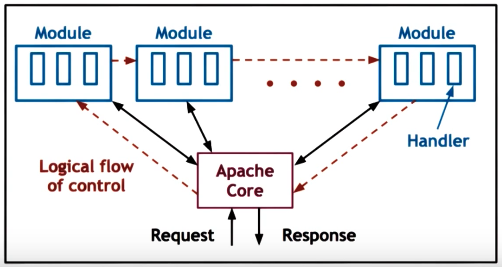

- core: basic server skeleton
- jmodules: per functionality
  - e.g. security features
- flow of control: similar to event driven model

but

Combination of MP + MT

- each process == boss.worker with dynamic thread pool
- number of processes can also be dynamically adjusted

### Setting up performance comparisons

- Define comparison points: what systems are you comparing?
  - MP (each process single thread)
  - MT (boss-worker)
  - Single Process Event-Driven (SPED)
  - Zeus (SPED with 2 processes)
  - Apache (v1.3.1, MP)
  => compare against Flash (AMPED model)
- Define inputs: what workloads will be used?
  - Used in Flash paper
    - CS WebServer trace (Rice Univ)
    - Owlnet trace (Rice Univ)
    - Synthetic workload
  - Realistic request workload => distribution of web page accesses over time
  - Controlled, reproducible workload => trace-based (from real webservers)
- Define matrics: how will you measure performance?
  - Bandwidth == bytes/time => total bytes transfered from files/total time
  - Connection Rate == request/time => total client connnections/total time
  - Evaluate both as a function of file size
    - larger file size => ammortize per connection cost => higher bandwidth
    - larger file size => more work per connection => lower connection rate

### Experiment Results

#### One synthetic file, repeated

- all exhibit similar results
- SPED has best performance
- Flash AMPED extra check for memory presence
- Zeus has anomaly
- MT/MP extra sync and context switching
- Apache lacks optimizations

#### Owlnet trace

- trends similar to synthetic 
- small trace, mostly fits in cache
- sometimes blocking I/O is required
  - SPED will block
  - Flash's helpers resolve the problem

#### CS Trace

- larger trace, mostly requires I/O
- SPED worst => lack of astnc I/O
- MT better than MP
  - smaller memory footprint, more memory to cache files
  - cheaper to sync
- Flash best
  - smaller memory footprint
  - more memroy for chaching
  - fewer requests lead to blocking I/O
  - no sync needed

#### Summary

- When data is in cache 
  - SPED >> AMPED Flash
    - unnecessary test for memory presence
  - SPED and AMPED Flash >> MT/MP
    - sync and context switching overhead
- With disk-bound workload
  - AMPED Flash >> SPED
    - blocks because no async I/O
  - AMPED Flash >> MT/MP
    - more memory efficient and less context switching

### Design relevant experiments

Relevant experiments => statements about a solution, that others believe in, and care for.
Goals => metrics and configuration of experiments

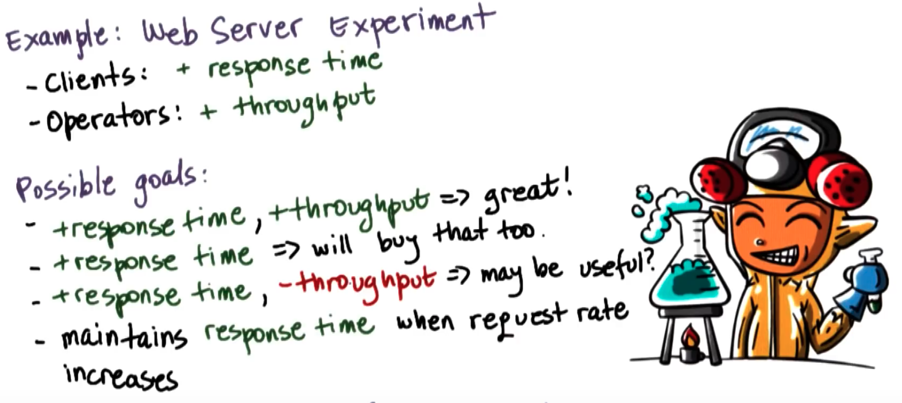

#### Picking the right metrics

"Rule of thumb" for picking metrics:

- "standard" metrics => broader audience
- metrics answering the "why? what? who?" questions
  - client performance => response time, number of time out reqeuests
  - operator costs => throughput, costs

#### Picking the right configuration space

- System Resources
  - hardware (CPU, memory, ...) and software (number of threads, queue sizes)
  - workload: webserver => request rate, number of concurrent requests, file size, access patter
  - now pick:
    - choose a subset of configuration parameters
    - pick ranges for each variable factor
    - pick relevant workload
    - include best/worst case scenarios
- Pick useful combinations of factors
  - many just reiterate the same point
- Compare Apples to Apples
- Compare system to
  - state of the art
  - most common practice
  - ideal best/worst case scenario